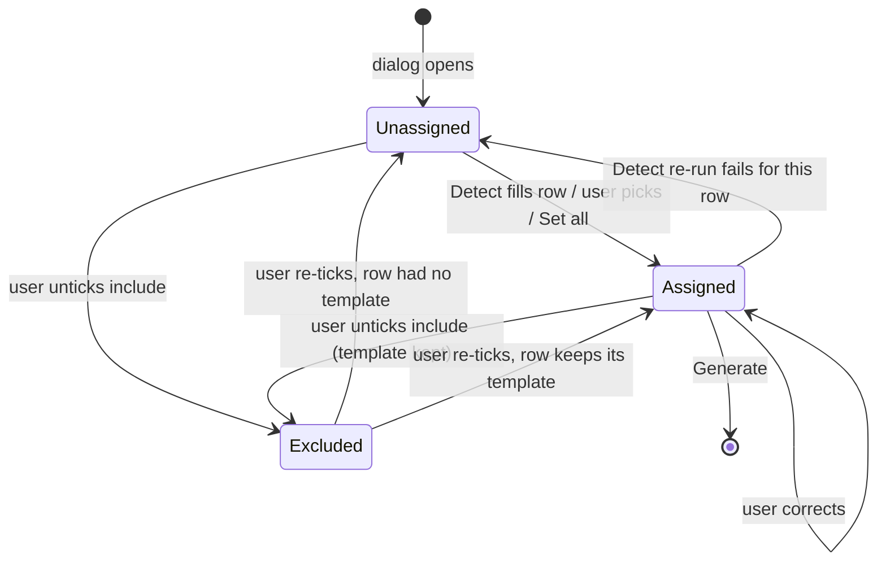
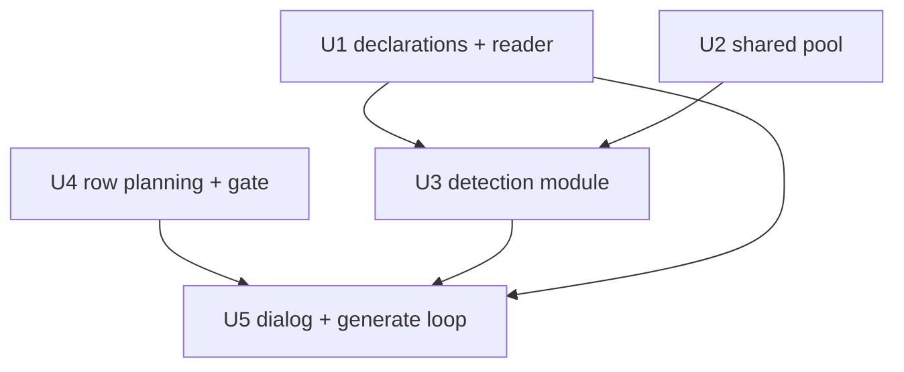

# Bulk Paper-Type Detection - Plan

## Goal Capsule

- **Objective:** A user who selects a mixed batch of papers in Zotero can generate one Summary Note per item, each rendered with the template that fits that paper's type, without hand-assigning a template to every item.
- **Means:** The bulk generation dialog becomes a per-item review list with an explicit "Detect types" action backed by a new pure detection module (KTD1) that asks the configured LLM to pick among templates declaring a paper type (KTD4).
- **Product authority:** This plan owns the bulk dialog, the template paper-type declaration, and the shared LLM worker pool. The single-item Composer, persistence of detected types on items, and detection from sources other than title and abstract are not active scope. Product behavior is owned by the R-IDs; implementation mechanism by the KTDs.
- **Stop conditions:** Stop and report if a settled decision proves unworkable in code, or if Detect would require an LLM call outside the explicit button (ADR-0001).
- **Execution profile:** Five dependency-ordered units, pure modules first, dialog last. Unit tests prove the pure modules; the dialog is verified by a manual smoke run.
- **Tail ownership:** The implementer owns the changelog entry and template docs. Release is cut separately by the maintainer.
- **Open blockers:** None.

---

## Product Contract

Product Contract preservation: changed: R7 — rows the existing-note policy will skip are exempt from the assignment gate (confirmed at planning synthesis), and the dialog names the no-row-included state; R5 — a row keeps its template across exclude and re-include (document review). Outstanding Questions resolved in place by KTD1, KTD3, KTD4, KTD7. All other requirements and IDs unchanged.

### Summary

Extend the bulk Summary Note dialog with a per-item list, a "Detect types" button, and per-row template pickers. Detection reads each item's title and abstract and picks among templates that declare a paper type; the user corrects misses, assigns or excludes anything unclassifiable, then Generate runs the existing per-item pipeline. Detection is a new pure module beside the existing LLM helpers, sharing one bounded worker pool with the block runner.

### Problem Frame

Since the bulk generation landed, a multi-item selection can only be rendered with one template for the whole batch. Real selections mix quantitative studies, qualitative work, theoretical papers, and reviews, and the four starter templates exist precisely because those types want different summary structures. Today the user must pre-sort the selection by type and run the bulk action once per type, or accept a mismatched template for part of the batch. The plugin already knows the abstract and has an LLM configured, so the sort is work the plugin can propose.

### Key Decisions

- **LLM detection with a review step, over a manual per-item dropdown alone or fully automatic generation.** Guessing is the value; the user only fixes misses. (session-settled: user-directed — chosen over a per-item picker with no detection and over generate-without-review: the batch is large enough that hand-assignment is the pain, and misses must stay correctable.) Governs R9, R10, R11.
- **Unclassifiable items block Generate until assigned or excluded, over a silent default template or skip-and-report.** (session-settled: user-approved — chosen over a fallback template and over skipping: a silent default hides the miss.) Governs R7, R12.
- **Detection runs only from an explicit button, over auto-running on dialog open or a separate menu entry.** Keeps ADR-0001 literal and lets a user who knows the types skip the call entirely. (session-settled: user-approved — chosen over auto-run: one API call per item should not fire from opening a dialog.) Governs R9, R17.
- **Templates declare their own paper type and description, over the LLM picking by template name or a fixed list with a preferences mapping.** Adding a type is adding a declared template. (session-settled: user-approved — chosen over name-matching and a prefs panel: names are unreliable and a mapping panel is UI to maintain.) Governs R1, R2, R3, R4, R10.
- **Nothing is persisted on the item, over a paper-type tag.** Every run re-detects; corrections are not remembered. (session-settled: user-directed — chosen over writing a tag that later runs and the Composer would reuse: keep the item untouched.) Governs R15.
- **The review list lives inside the existing bulk dialog; the Composer is untouched.** (session-settled: user-approved — chosen over adding a Detect button to the Composer and over a router template that classifies inside an LLM block: the bulk flow is where the pain is, and a router template has no review step.) Governs R5, R6.
- **A "Set all to…" shortcut preserves today's one-template path inside the list.** Governs R6.
- **Detection failures are loud and partial.** A failed call leaves its rows unassigned with the reason shown; there is no retry and no fallback. Governs R12, R13, R14.
- **Rows the existing-note policy will skip are exempt from the assignment gate.** Their template is never used, so demanding one is noise. (session-settled: user-approved — chosen over a literal every-included-row gate: the row never renders.) Governs R7.

Row lifecycle inside the dialog:



### Requirements

**Template paper-type declaration**

- R1. A document template may declare, in its frontmatter, one paper-type label and a one-line description of the papers it fits.
- R2. The four built-in starter templates ship with declarations: quantitative, qualitative, theoretical, review.
- R3. Only templates carrying a declaration are detection candidates; undeclared templates remain selectable by hand in every per-row picker.
- R4. A declaration never appears in a Summary Note; frontmatter is stripped as today.

**Bulk dialog review list**

- R5. The bulk dialog lists every selected regular item in selection order with its title, a per-row template picker, and an include toggle; excluded rows are not generated, and a row keeps its template across exclude and re-include.
- R6. Rows open unassigned; a "Set all to…" control assigns one template to every included row in one action.
- R7. Generate is unavailable while any included row that the existing-note policy would render is unassigned, and the dialog states how many rows still need a template, or that no row is included.
- R8. The existing-note policy (skip, additional, overwrite) and the up-front LLM configuration check behave as they do today.

**Detection**

- R9. Detection runs only when the user clicks "Detect types"; nothing runs on dialog open, on selection change, or on a picker change.
- R10. Detection sends the item's title and abstract only, and asks the configured LLM to choose one candidate template (per R3) using each candidate's declared type and description.
- R11. A successful detection sets the row's picker and shows the detected type label beside it so a miss is visible at a glance; a later Detect click replaces earlier assignments on every included row, except a row the user edits or unticks while that run is still in flight, which keeps the user's state.
- R12. A row stays unassigned, with a one-line reason shown on the row, when the item has no abstract, the answer names no candidate, or the call for that item fails; other rows are unaffected.
- R13. "Detect types" is disabled with a visible reason when the LLM is not configured or no candidate template exists.
- R14. Detection honours the LLM concurrency preference, shows progress while running, and never retries automatically.
- R15. Detection results are not written to the item and are not kept between dialog openings.

**Generate**

- R16. Generate runs the existing per-item pipeline with each row's assigned template; per-item failures stay non-fatal and are reported at the end as today.
- R17. A user can Generate without ever running detection by using Set all or the per-row pickers.

### Key Flows

- F1. Detect, review, generate
  - **Trigger:** User multi-selects items and chooses the bulk generation menu entry.
  - **Steps:** Dialog opens with all rows unassigned. User clicks Detect types. Rows fill in as answers arrive; unclassifiable rows show a reason. User corrects misses, assigns or excludes the flagged rows, sets the existing-note policy. Generate becomes available once no gated row is unassigned. Pipeline runs per item; failures are listed at the end.
  - **Covered by:** R5, R7, R9, R10, R11, R12, R14, R16.
- F2. Skip detection
  - **Trigger:** Same menu entry; the user already knows the batch is one type, or the LLM is unavailable.
  - **Steps:** User picks Set all to one template, optionally adjusts single rows, then Generate.
  - **Covered by:** R6, R13, R16, R17.

### Acceptance Examples

- AE1. **Covers R10, R11.** Given five selected items whose abstracts describe two surveys, two interview studies, and one literature review, and the four built-ins declared, when the user clicks Detect types, then the rows show quantitative, quantitative, qualitative, qualitative, review with the matching template selected in each picker.
- AE2. **Covers R12, R7.** Given one of the items has an empty abstract, when Detect runs, then that row stays unassigned with "no abstract" as the reason, Generate stays unavailable, and it becomes available once the user picks a template for that row or unticks it.
- AE3. **Covers R12, R14.** Given the LLM endpoint returns an error for the third item, when Detect runs, then the other four rows are filled, the third shows the error text as its reason, and no retry is attempted.
- AE4. **Covers R13.** Given no model is set (the LLM counts as unconfigured only when base URL or model is empty; the API key is optional), when the dialog opens, then Detect types is disabled and the dialog says the LLM is not configured; Set all and per-row pickers still work.
- AE5. **Covers R3, R13.** Given the user's Templates folder overrides all four built-ins with copies that carry no declaration, when the dialog opens, then Detect types is disabled with a reason saying no template declares a paper type, and those copies are still pickable by hand.
- AE6. **Covers R6, R17.** Given a batch the user knows is all reviews, when they choose Set all to the review template and click Generate, then no LLM classification call is made and every item is rendered with the review template.
- AE7. **Covers R11.** Given the user corrected a detected row by hand, when they click Detect types again, then the row is re-detected and the hand correction is replaced.
- AE8. **Covers R15.** Given a completed run, when the user re-opens the bulk dialog for the same items, then every row is unassigned again and no paper-type tag or field exists on the items.
- AE9. **Covers R4.** Given a template with a paper-type declaration, when a Summary Note is generated from it, then the note contains no trace of the declaration.
- AE10. **Covers R7.** Given policy "skip" and one selected item that already has a Summary Note, when that row is left unassigned and every other included row is assigned, then Generate is available and that item is skipped as today.
- AE11. **Covers R7.** Given every row unticked, when the user looks at the dialog, then Generate is unavailable and the dialog says no item is selected rather than reporting zero unassigned rows.
- AE12. **Covers R11.** Given Detect is running and the user changes the picker on a row whose answer has not arrived yet, when that answer arrives, then the user's choice stands and the detected label is not shown for that row.
- AE13. **Covers R5.** Given a row assigned the review template, when the user unticks and re-ticks it, then the review template is still selected.
- AE14. **Covers R11.** Given Detect is running, when the user unticks a row before its answer arrives and re-ticks it after the run, then the row is unassigned and shows no detected label.

### Success Criteria

- On a mixed batch, the user's only interaction between Detect and Generate is correcting misses and resolving flagged rows.
- A user with no LLM configured loses nothing compared with today's dialog.

### Scope Boundaries

- A Detect button in the single-item Composer is deferred; the same helper could surface there later.
- Persisting the detected or corrected type on the item (tag or field) is out.
- Detection input beyond title and abstract (fulltext, tags, Zotero item type, annotations) is out.
- Confidence scores, rationale text, or a second-opinion call are out; the visible type label is the only signal.
- Caching detections between dialog openings is out.
- A template declaring more than one paper type is out; one label per template.
- The router-template alternative (classification inside an LLM block) is rejected, not deferred.

#### Deferred to Follow-Up Work

- A headless integration spec for the bulk dialog under `test/integration/`; today's dialog has none and this plan keeps parity (KTD7).
- Honouring the pool's stop predicate from the Composer's Run LLM and bulk Generate so those runs can be interrupted too; this plan wires it for detection only (KTD5).
- Passing `errorDelayMax: 0` on the Composer's Run LLM and bulk Generate requests as well; today a 5xx there is retried by Zotero for up to an hour behind the progress window (pre-existing). A 503 carrying a numeric Retry-After header is still waited on once by Zotero regardless of that option.
- Row virtualization for very large selections; a plain scrollable list ships first (KTD7).

### Dependencies / Assumptions

- Templates already carry YAML frontmatter that the Template Builder parses and the note pipeline strips, so the declaration has a home without a new file format.
- User files in the Templates folder override built-ins of the same name. A user who copied a built-in before this ships must add the declaration to their copy for it to become a candidate.
- Detection uses the same provider, model, key, timeout, and concurrency preferences as LLM blocks; no separate classifier configuration is added.
- Assumed: the four starter template types are enough for the user's library; new types are handled by adding declared templates, not by changing the plugin.

### Sources / Research

- Bulk menu entry and dialog: `addon/bootstrap.js` `ITEM_MENU_IDS` wiring near line 2052; `openBulkDialog` (lines 2238-2375) builds a fixed overlay with an `h(tag, cls)` element helper, a `mkRadio` closure, a `settle()` promise resolver, and the sequence-guarded `refreshHeadsUp` LLM check.
- Per-item loop: `generateSummaryNotes` (`addon/bootstrap.js` 2382-2461) runs a pre-flight `isLLMConfigured` probe, calls pure `planBulk`, drives `pw.changeHeadline` per item, and collects `failures` through `sanitizeError`. Continue-and-report rule: `src/bulk.js` header comment.
- Per-item LLM resolution and the `fetchFn` wrapper around `Zotero.HTTP.request`: `resolveSummaryMdForItem` (`addon/bootstrap.js` 2158-2237).
- Built-in templates with no frontmatter: `addon/bootstrap.js` 132-262; document-vs-format kind only: `templateKindOf` (632-646) and `templateKind` (`src/templates.js` 52-66).
- Frontmatter helpers return key names only, never values: `templateUserOwnedKeys` (`src/templates.js` 72-90), `frontmatterRange` and `frontmatterFieldKeys` (`src/builder.js` 205-245). Frontmatter is stripped before HTML in `src/strip-markers.js` 46-50.
- LLM builders: `src/llm.js` exports `LLM_DEFAULTS`, `isLLMConfigured`, `sanitizeLLMSettings`, `buildChatCompletionsURL`, `buildLLMHeaders`, `buildChatCompletionsPayload`, `parseChatCompletionsResponse`, `sanitizeError`. Inline bounded worker pool: `executeLLMBlocks` in `src/llm-runner.js` 251-289. Prefs snapshot: `getLLMSettings` (`addon/bootstrap.js` 828-840); concurrency clamps to 1-8 in `src/llm.js` 59.
- Item fields: `buildItemData` reads `item.getField("title")` and `item.getField("abstractNote")` (`src/item-data.js` 89-113).
- Template loading and picker order: `loadTemplates`, `allTemplates`, `orderedTemplateNames` (`addon/bootstrap.js` 672-743). UI strings: `STRINGS` bulk keys (`addon/bootstrap.js` 452-464) read through `this.t`.
- Explicit-action and fail-loud rules: `docs/adr/0001-explicit-static-llm-interpreter.md`; compose gating in `src/compose-gating.js`.
- Built-in template guard test extracts the literal from bootstrap source: `test/builtin-templates.spec.js`.
- Docs: `docs/TEMPLATES.md` lists the paper-type templates around lines 283-298 and states frontmatter never reaches a note near line 240; `CHANGELOG.md` uses prose entries under `## [Unreleased]`.

---

## Planning Contract

### Key Technical Decisions

- KTD1. **Detection is a new pure module `src/paper-type.js` that bypasses the block runner.** It exposes candidate extraction, prompt building, answer parsing, and a batch runner that takes `fetchFn`, sanitized settings, and a per-row callback, mirroring `executeLLMBlocks`'s contract. It uses the `src/llm.js` builders directly because the block runner only resolves `` blocks already inside rendered text. Reached from the dialog as `win.ZONCore.*` after re-export from `core/core.js`. Governs R9, R10, R12, R14.
- KTD2. **The bounded worker pool is extracted from `executeLLMBlocks` into `src/llm-pool.js` and reused by both runners.** (session-settled: user-approved — chosen over duplicating the pool inline in the detection module: two copies of the same concurrency logic drift.) The block runner keeps its all-or-nothing, lowest-index-failure semantics on top of the shared primitive; detection uses per-task results instead. Governs R14.
- KTD3. **The model answers with a candidate number from a numbered list, not free text matched against labels.** (session-settled: user-approved — chosen over matching the reply against type labels: label text is ambiguous and two templates may share a label.) The prompt lists candidates as `1..n` with label and description and asks for a single integer, `0` when none fits. The parser accepts a reply that contains exactly one integer, within `0..n`, ignoring surrounding punctuation or words; a reply with no integer or more than one is "names no candidate" per R12. Governs R10, R12.
- KTD4. **Declaration keys are `paperType` and `paperTypeDescription` in template frontmatter, read by a new `frontmatterFieldValue(text, key)` in `src/templates.js`.** No bootstrap mirror is needed: the dialog runs after the core bundle is injected and calls the core export, unlike `parseTemplateText`, which runs before the bundle is guaranteed. Built-ins gain a leading frontmatter block carrying only these two keys, which keeps `templateKind` classifying them as documents. Governs R1, R2, R3, R4.
- KTD5. **A monotonically increasing run token guards Detect; Generate, Detect, and Set all are disabled while a run is in flight; cancelled runs stop claiming and abort in flight.** Mirrors the `headsUpSeq` guard already in the dialog. Closing the dialog is the only mid-run cancel path: it flips the pool's stop predicate so no further row is claimed, and the dialog's `fetchFn` wrapper collects each request's cancel function from the `cancellerReceiver` option of `Zotero.HTTP.request` and invokes them, so in-flight calls abort instead of completing against a closed dialog. The same wrapper passes `errorDelayMax: 0` so a 5xx from the endpoint rejects at once instead of entering Zotero's built-in retry loop, which is what makes R14's no-retry rule hold. Any result that still arrives for a stale token, or for a row the user touched during the current run (picker change or include toggle), is discarded. Governs R9, R11, R14.
- KTD6. **Row planning and gating stay pure in `src/bulk.js`.** `planBulk` accepts a per-row `templateName` and an `included` flag; a new `bulkGate(rows, policy)` returns whether Generate is available, how many rows still need a template, and how many rows are included, exempting rows that would be skipped under the current policy; zero included rows is its own state. Rows carry `hasExistingNote`, computed once when the dialog opens. Governs R5, R6, R7, R16, R17.
- KTD7. **The dialog stays a plain DOM overlay: wider panel, scrollable row list, no virtualization, no automated UI test.** (session-settled: user-approved — chosen over adding a headless bulk integration spec now: today's dialog has none, and the pure modules carry the logic.) New strings go in `STRINGS`, not the Fluent files. Governs R5, R11, R12, R13.
- KTD8. **Detection reuses `sanitizeLLMSettings(getLLMSettings())` unchanged.** The same base URL, model, key, temperature, timeout, and concurrency apply; the payload asks for a one-token answer, so no separate max-tokens or classifier prefs are introduced. The abstract is cut to `maxContextChars` before it is sent, matching how block contexts are bounded.

### High-Level Technical Design

Detect run, from click to row update:

```mermaid
sequenceDiagram
  participant D as Bulk dialog (bootstrap.js)
  participant P as paper-type.js
  participant L as llm-pool.js
  participant M as LLM endpoint
  D->>D: click Detect; token++; disable Detect, Generate, Set all
  D->>P: candidates from declared templates (KTD4)
  D->>P: detectPaperTypes(rows{title, abstract}, candidates, settings, fetchFn, onRow)
  P->>L: runBounded(tasks, concurrency)
  loop up to concurrency at once
    L->>M: chat completion with numbered candidates (KTD3)
    M-->>L: reply text
    L-->>P: parsed {index} or {reason}
    P-->>D: onRow(rowKey, result)
    D->>D: if token current and row untouched: set picker, label, or reason
  end
  P-->>D: all rows settled
  D->>D: re-enable Detect; run bulkGate (KTD6)
```

Unit dependency order:



---

## Implementation Units

### U1. Paper-type declarations and frontmatter value reader

- **Goal:** Templates can declare a paper type, the four built-ins do, and code can read the declaration.
- **Requirements:** R1, R2, R3, R4; AE5, AE9. KTD4.
- **Dependencies:** None.
- **Files:** `src/templates.js`, `test/templates.spec.js`, `addon/bootstrap.js` (`BUILTIN_TEMPLATES`, `note-quantitative`, `note-qualitative`, `note-theoretical`, `note-review`), `test/builtin-templates.spec.js`, `core/core.js`, `docs/TEMPLATES.md`.
- **Approach:**
  1. Add `frontmatterFieldValue(text, key)` beside `templateUserOwnedKeys`, reusing its frontmatter regex; return the trimmed scalar after the colon, quotes stripped, or `null` when the block or key is absent.
  2. Add `paperTypeDeclaration(text)` returning `{ label, description }` or `null` (label required, description optional), and `paperTypeCandidates(templates)` mapping `{ name, text }` document templates to `{ name, label, description }` for declared ones only.
  3. Prepend a frontmatter block with the two keys to each of the four built-ins; update the built-in guard test so classification and rendering assertions still hold with frontmatter present, including relaxing its no-leading-frontmatter assertion for these four names.
  4. Re-export the three functions from `core/core.js`.
  5. Document the keys in `docs/TEMPLATES.md` next to the paper-type template list, with a note that a user copy of a built-in needs the keys added to take part in detection.
- **Patterns to follow:** `templateUserOwnedKeys` regex and style in `src/templates.js`; one-line re-export convention in `core/core.js`; `test/builtin-templates.spec.js` literal extraction.
- **Test scenarios:**
  - Frontmatter with `paperType: quantitative` returns `quantitative`; a quoted value returns the unquoted string.
  - Text with no frontmatter, or frontmatter without the key, returns `null`.
  - A key present only in the body (after the closing `---`) is not read.
  - `paperTypeDeclaration` returns `null` when the label is empty, and returns the description when present.
  - `paperTypeCandidates` over a mixed list returns only declared templates, in input order, and skips `format`-kind templates even if declared.
  - Covers AE5. All four built-ins yield a declaration with the expected labels; `templateKind` still reports `document` for each.
  - Covers AE9. Rendering a declared built-in and passing it through `stripFrontmatter` leaves no `paperType` text.
- **Verification:** `npm test` green; `npm run build` succeeds; the four labels appear in the built-in literal and in `docs/TEMPLATES.md`.

### U2. Shared bounded worker pool

- **Goal:** One concurrency primitive serves both the block runner and detection.
- **Requirements:** R14. KTD2.
- **Dependencies:** None.
- **Files:** `src/llm-pool.js` (new), `test/llm-pool.spec.js` (new), `src/llm-runner.js`, `test/llm-runner.spec.js`.
- **Approach:**
  1. Create `runBounded(n, concurrency, fn, { stopOnFailure, shouldStop })` that claims indices in order, runs at most `concurrency` workers, and resolves to an array of per-index results; with `stopOnFailure` it stops claiming after the first rejection but awaits in-flight tasks; `shouldStop()` is checked before every claim and, when true, leaves unclaimed indices unset.
  2. Rewrite the inline pool in `executeLLMBlocks` on top of it, preserving lowest-index-failure reporting and progress callbacks; the runner's task function must reject with a tagged error on empty content so the pool's stop-on-failure semantics still cover the empty-response case. Existing runner tests must pass unchanged.
- **Execution note:** Refactor under the existing `test/llm-runner.spec.js` coverage first; add pool tests before wiring detection to it.
- **Patterns to follow:** The comment block and semantics at `src/llm-runner.js` 251-289.
- **Test scenarios:**
  - With concurrency 2 and 5 tasks, no more than 2 tasks are in flight at once (track a counter inside `fn`).
  - Results land at their task index regardless of completion order.
  - With `stopOnFailure`, a rejection at index 1 prevents index 3 from starting while index 2, already in flight, still completes.
  - Without `stopOnFailure`, every task runs and rejections are returned per index.
  - Concurrency larger than the task count spawns only `n` workers; zero tasks resolves immediately.
  - With `shouldStop` returning true after the second claim, no further task starts and the unclaimed indices come back unset while claimed ones complete.
  - Existing `executeLLMBlocks` tests pass unchanged after the refactor, including the empty-response stop case.
- **Verification:** `npm test` green with the runner suite untouched.

### U3. Detection module

- **Goal:** Given rows and candidates, produce a per-row template choice or reason through the configured LLM.
- **Requirements:** R9, R10, R12, R13, R14; AE1, AE2, AE3. KTD1, KTD3, KTD8.
- **Dependencies:** U1, U2.
- **Files:** `src/paper-type.js` (new), `test/paper-type.spec.js` (new), `core/core.js`.
- **Approach:**
  1. `buildDetectMessages(candidates, { title, abstractNote })` returns chat messages: a short system prompt, then a user message listing candidates as numbered `label — description` lines, then title and abstract, asking for one integer and `0` for none.
  2. `parseDetectAnswer(text, n)` extracts the integers in the reply; exactly one integer in `1..n` returns `{ index }`, exactly one integer equal to `0` returns `{ none: true }`, and no integer, more than one, or one outside `0..n` returns `{ invalid: true }`.
  3. `detectPaperTypes(rows, candidates, settings, fetchFn, onRow, { shouldStop })` sanitizes settings, cuts each abstract to `maxContextChars`, precomputes rows with an empty abstract as `{ reason: "no-abstract" }` without calling the model, runs the rest through `runBounded` at `settings.concurrency` passing `shouldStop` through, and calls `onRow(key, result)` as each settles, where result is `{ templateName, label }` or `{ reason, detail }`; reasons are stable codes (`no-abstract`, `no-candidate`, `invalid-answer`, `http-failed`) that the dialog maps to strings.
  4. Errors are passed through `sanitizeError`; the module never throws for a single row.
  5. Re-export the three functions from `core/core.js`.
- **Patterns to follow:** `executeLLMBlocks` signature and settings handling in `src/llm-runner.js`; `buildLLMMessages`, `buildChatCompletionsURL`, `buildLLMHeaders`, `buildChatCompletionsPayload`, `parseChatCompletionsResponse` in `src/llm.js`; error codes style of `LLM_RUN_ERRORS`.
- **Test scenarios:**
  - Covers AE1. Five rows, four candidates, a fake `fetchFn` answering `1,1,2,2,4`: `onRow` reports the matching template names and labels for each row.
  - Covers AE2. A row with an empty abstract gets `no-abstract` and `fetchFn` is not called for it.
  - Covers AE3. `fetchFn` rejects for the third row only: that row gets `http-failed` with the sanitized message; the other rows succeed; `fetchFn` is called exactly once per non-empty row (no retry).
  - Reply `0` yields `no-candidate`; reply `7` with four candidates yields `invalid-answer`; reply `"Option 2 fits best"` yields index 2; reply `"None of the 4 fit: 0"` yields `invalid-answer` (two integers); an empty reply yields `invalid-answer`.
  - An abstract longer than `maxContextChars` is truncated in the user message.
  - With `shouldStop` returning true after the first row settles, remaining rows get no call and no `onRow` result.
  - The user message contains every candidate's label and description in numbered order and the row's title and abstract.
  - With concurrency 1 and three rows, calls happen strictly in sequence.
  - Empty candidate list resolves every row with `no-candidate` without calling `fetchFn`.
- **Verification:** `npm test` green; `win.ZONCore.detectPaperTypes` exists after `npm run build`.

### U4. Per-row bulk planning and gate

- **Goal:** Pure planning knows each row's template and whether Generate may run.
- **Requirements:** R5, R6, R7, R16, R17; AE6, AE10. KTD6.
- **Dependencies:** None.
- **Files:** `src/bulk.js`, `test/bulk.spec.js`, `core/core.js`.
- **Approach:**
  1. Extend `planBulk` input rows with `templateName` and `included`; an excluded row plans as `skip`; the returned plan carries `templateName` through.
  2. Add `bulkGate(rows, policy)` returning `{ canGenerate, unassigned, included }` where `unassigned` counts included rows with no `templateName` whose planned action is not `skip`, and `included` counts ticked rows; `canGenerate` is false when `included` is 0.
  3. Re-export `bulkGate`.
- **Patterns to follow:** Existing `planBulk` shape and its seven tests.
- **Test scenarios:**
  - Existing `planBulk` tests pass with rows that carry the new fields.
  - An excluded row plans as `skip` under every policy.
  - Covers AE10. Policy `skip`, one row with an existing note and no template, all other rows assigned: `canGenerate` is true and `unassigned` is 0.
  - Same rows under policy `additional`: `canGenerate` is false and `unassigned` is 1.
  - Covers AE11. All rows excluded: `canGenerate` is false with `unassigned` 0 and `included` 0.
  - Covers AE6. All rows assigned the same template: `canGenerate` true.
- **Verification:** `npm test` green.

### U5. Bulk dialog review list, Detect, and Generate wiring

- **Goal:** The dialog shows the per-item list, runs detection on click, gates Generate, and the loop renders each row with its own template.
- **Requirements:** R5 through R17; F1, F2; AE1 through AE8. KTD5, KTD7, KTD8.
- **Dependencies:** U1, U3, U4.
- **Files:** `addon/bootstrap.js` (`openBulkDialog`, `generateSummaryNotes`, `STRINGS`), `CHANGELOG.md`.
- **Approach:**
  1. `openBulkDialog` takes the selected items instead of a count and builds one row per item, in selection order, as `{ key, title, hasExistingNote, templateName: null, included: true }` with `hasExistingNote` from `existingSummaryNotes(item)`. Replace the single template `<select>` with a scrollable list, one row per item: title, include checkbox, template picker (all document templates, undeclared included, per R3), a status slot that shows detecting, the detected label, or the failure reason, which wraps to as many lines as it needs so the full text is readable without hover. Unticking a row disables its picker but keeps its value, and during a run it marks the row touched. Widen the panel and cap the list height with internal scroll.
  2. Add a "Set all to…" picker plus apply button, the "Detect types" button, a progress line, and the existing-note radios unchanged.
  3. Compute candidates from `allTemplates(win)` through the core export (KTD4). Disable Detect with a reason when `!isLLMConfigured(settings)` or no candidates (R13), reusing `refreshHeadsUp`'s sequence guard.
  3b. Rework the LLM heads-up to run over the set of distinct templates assigned to rows the gate counts: render each once for the first item, and disable Generate with the existing not-configured warning when any contains an LLM block while the LLM is unconfigured; re-run it in the same handler as the gate on every picker, checkbox, Set all, or policy change (R8).
  4. On Detect: bump the run token, disable Detect, Generate, and Set all, clear each included row's touched flag and show its detecting state, gather `{ key, title, abstractNote }` per included row via `item.getField`, and call `detectPaperTypes` with a `fetchFn` wrapper that mirrors the one in `resolveSummaryMdForItem` but also registers each request's cancel function via `cancellerReceiver` and passes `errorDelayMax: 0`. Any picker change or include toggle during the run sets that row's touched flag. In `onRow`, update the row only when the token is current and the row is untouched (KTD5). `settle()` flips the stop predicate and invokes the collected cancel functions. On completion re-enable the controls and re-run the gate.
  5. Re-run `bulkGate` on every picker, checkbox, or policy change; disable Generate and show the unassigned count, or the no-item-selected message when nothing is included (R7).
  6. `settle` resolves with `{ rows: [{ key, templateName, included }], policy }`; `generateSummaryNotes` runs its pre-flight LLM probe over the same distinct-template set as step 3b, then passes each row's template to `resolveSummaryMdForItem` and keeps the existing progress and failure reporting.
  7. Add strings for the button, Set all, the detecting state, per-row reasons (no abstract, no candidate, invalid answer, call failed), the disabled-Detect reasons, the unassigned count, and the no-item-selected message.
  8. Add a prose entry under `## [Unreleased]` in `CHANGELOG.md`.
- **Execution note:** The dialog has no automated coverage; verify by running `npm start` against the dev profile and walking the manual scenarios below before declaring the unit done.
- **Patterns to follow:** `h()` element helper, `mkRadio`, `settle`, `headsUpSeq` guard in `openBulkDialog`; `this.t` string interpolation; `fetchFn` wrapper in `resolveSummaryMdForItem`; failure collection in `generateSummaryNotes`.
- **Test scenarios (manual smoke in Zotero):**
  - Covers AE1. Mixed five-item selection, click Detect: rows fill with the expected labels; Generate enables once all rows are assigned.
  - Covers AE2. Item with empty abstract: row shows the no-abstract reason; Generate disabled with count 1; ticking off the row enables Generate.
  - Covers AE3. Point the base URL at an endpoint that answers 503 (a local stub) for one run: rows show the call-failed reason at once; exactly one request per row appears in the debug log. Repeat with an unreachable host for the connection-error path.
  - Covers AE4. Clear the model preference: Detect disabled with the not-configured reason; Set all and Generate still work.
  - Covers AE5. Override all four built-ins with undeclared copies in the Templates folder: Detect disabled with the no-candidates reason; copies pickable per row.
  - Covers AE6. Set all to review, Generate: every note uses the review template; the debug log shows no detection request.
  - Covers AE7. Correct one row by hand, click Detect again: the row is re-detected.
  - Covers AE8. Re-open the dialog after a run: rows unassigned; no new tags on the items.
  - Close the dialog while Detect is running on a large batch: no error in the console, the debug log shows no request issued after the close, and reopening shows a fresh unassigned list.
  - Covers AE12. Change a row's picker while Detect is still running: the row keeps the manual choice when its answer arrives.
  - Covers AE11. Untick every row: Generate is disabled and the dialog says no item is selected.
  - Covers AE13. Untick and re-tick an assigned row: its template is still selected.
  - Covers AE14. Untick a row while its detection is pending, re-tick after the run: the row is unassigned with no detected label.
  - Policy `skip` with an item that already has a Summary Note left unassigned: Generate available; item skipped in the final report.
- **Verification:** `npm run build` succeeds; `npm test` green; `npm run test:zotero` still passes; every manual scenario above observed in the dev profile.

---

## Verification Contract

| Check | Command | Applies to | Passes when |
|---|---|---|---|
| Unit tests | `npm test` | U1, U2, U3, U4 | All Vitest suites green, including the updated built-in guard test |
| Bundle build | `npm run build` | U1, U3, U4, U5 | `.scaffold/build/` xpi produced; `core.bundle.js` exports the new functions |
| Integration suite | `npm run test:zotero` | U5 | Existing `test/integration/` specs still pass in headless Zotero |
| Manual smoke | `npm start` | U5 | Every manual scenario in U5 observed in the dev profile |

---

## Definition of Done

- Every R-ID is satisfied and every AE is demonstrated, either by a unit test naming it or by the U5 manual scenario naming it.
- The three checks in the Verification Contract that run in CI (`npm test`, `npm run build`, `npm run test:zotero`) pass.
- No LLM request is issued outside the Detect click or the existing Run LLM and bulk Generate paths.
- `docs/TEMPLATES.md` documents `paperType` and `paperTypeDescription`; `CHANGELOG.md` has the Unreleased entry.
- No abandoned experiments remain in the diff: the inline pool in `src/llm-runner.js` is gone, not duplicated, and no debugging output is left in the dialog.
