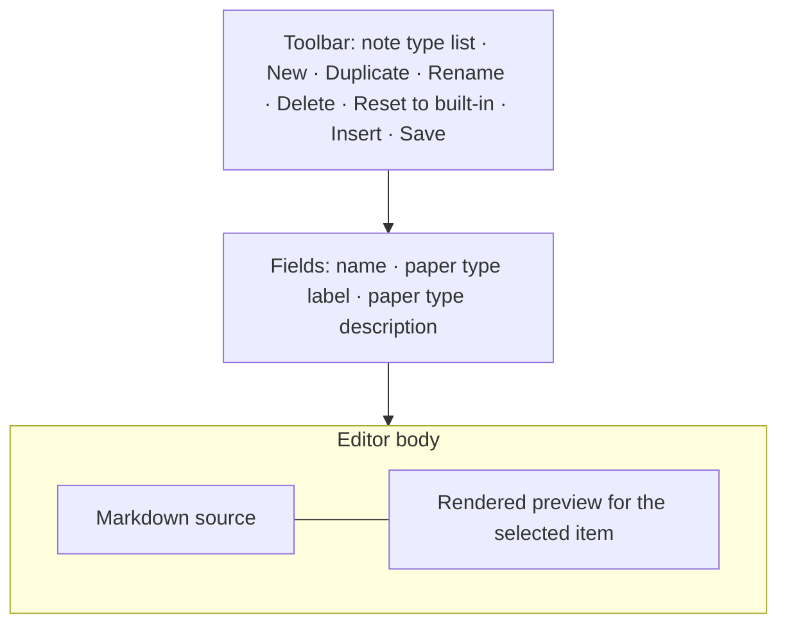
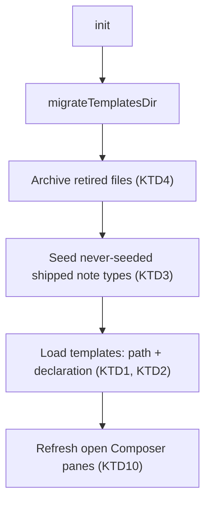
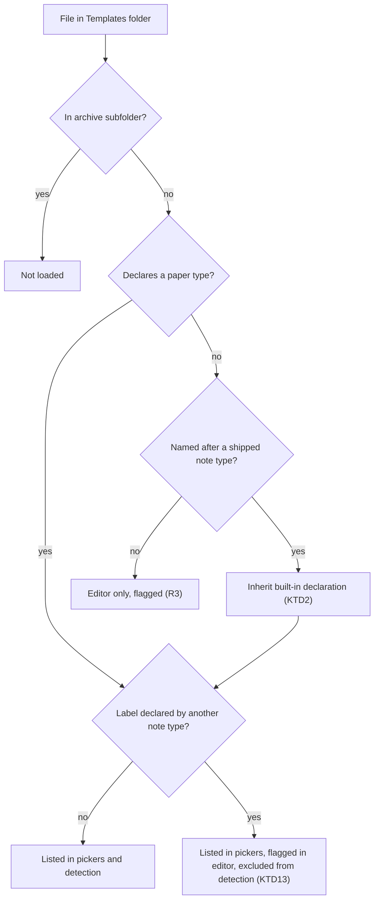
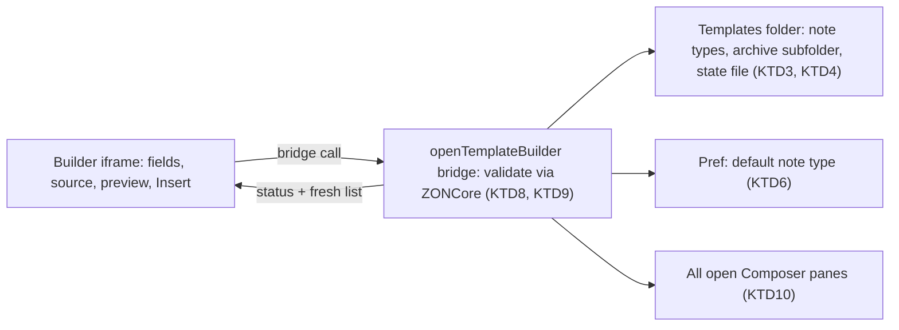

# Note Types Editor - Plan

## Goal Capsule

- **Objective:** When generating a Summary Note, the researcher can only choose among real note types, each tied to one paper type, and can create and maintain those note types in-app without ever meeting a building block.
- **Means:** Repurpose the Template Builder into a note-type editor and retire building-block and general templates through a run-once archive (KTD4, KTD8).
- **Product authority:** This Product Contract, then the Planning Contract. ADR-0001 (explicit static LLM) and ADR-0002 (one-way, create-once notes) still bind.
- **Stop conditions:** Stop and report if a settled decision proves infeasible in code, or if retirement would need to delete or overwrite a user file.
- **Execution profile:** Deep. Pure rules land in `src/` with Vitest first; privileged work concentrates in `addon/bootstrap.js`; the overlay UI is verified by manual smoke.
- **Finishing:** The `lfg` pipeline implements, reviews, and opens the PR; the maintainer cuts the release locally.
- **Open blockers:** None.

---

## Product Contract

### Summary

The Template Builder becomes a note-type editor: markdown source beside a rendered preview for a real item, with required paper-type fields, a small Insert menu, and Save, Duplicate, Rename, Delete, and Reset to built-in.
Building-block templates and the general note types (`note`, `note-minimal`, `note-by-colour`) go away, so every selectable template is a note type with its own paper type.

### Problem Frame

The researcher uses the plugin to generate typed summaries: qualitative, quantitative, theoretical, review.
The template system still carries the upstream plugin's authoring model, where a Templates folder mixes whole-note scaffolds with per-annotation and per-field building blocks, and the Template Builder's palette and block configurator put both kinds side by side.
While authoring, the researcher could not tell building blocks from proper note types.

#46 tried to hide building blocks from the pickers by sniffing template content, with a `%%! … %%` directive to force block classification.
Seeded on-disk copies shadow the built-ins, so a `research-questions.md` seeded before #46 has no directive, sniffs as a whole note because it contains an `` block, and is still offered as a summary to generate.
Any classification rule that guesses from content will keep leaking this way.

### Key Decisions

- **Note types are the only template kind.** Building blocks were the thing the researcher could not distinguish, so they stop existing rather than being hidden. Governs R1, R2, R10. (session-settled: user-approved — chosen over keeping blocks hidden, or listing them separately in the editor: blocks were indistinguishable from note types)
- **Side-by-side editor.** Markdown on the left, rendered note for the selected item on the right. Governs R9. (session-settled: user-directed — chosen over Obsidian-style live preview, Edit/Preview tabs, and a section-list builder, from a visual sketch)
- **Retired files are archived, not left in place.** Removes the need for any classification guess afterwards and keeps files recoverable. Governs R6, R16. (session-settled: user-approved — chosen over leaving them in place hidden, or in place and listed)
- **Paper type is required, set through editor fields.** Every note type participates in bulk detection. Governs R1, R11. (session-settled: user-directed — chosen over typing the declaration into frontmatter by hand, and over optional fields)
- **General note types are retired.** Only paper-type note types remain. Governs R5. (session-settled: user-directed — chosen over a single catch-all "general" type, giving each general template its own paper type, or requiring declarations only for newly saved types)
- **Undeclared files are editor-only.** A file without a paper type never reaches a generation picker but stays fixable in-app. Governs R3. (session-settled: user-approved — chosen over listing it in pickers with a mark, or auto-archiving it)
- **Paper type labels are unique.** Detection maps one paper type to exactly one note type. Governs R4, R14. (session-settled: user-approved — chosen over allowing several note types to share a label)
- **Insert menu instead of the block palette.** Snippets remove the need to remember syntax without reintroducing configurators. Governs R12. (session-settled: user-approved — chosen over docs-only authoring, and over inline autocomplete)
- **Full maintenance actions in the editor.** Governs R13, R14, R15, R16, R17. (session-settled: user-directed — Duplicate, Rename, Delete-as-archive, and Reset to built-in all chosen from the offered set)
- **The Settings default follows the note type.** Today a default naming a missing template silently renders an empty note body. Governs R8.
- **At least one note type always exists.** The Composer needs something to generate from. Governs R18.

### Requirements

**Note types as the only template kind**

- R1. Every template offered for generation is a note type: a whole-note template declaring a paper type label and a one-line description. The Composer picker, Settings → Default note template, and the bulk summary-note dialog list exactly the declared note types.
- R2. Building-block templates are not shipped, not listed anywhere, and cannot be authored in the editor.
- R3. A template file without a paper type declaration is excluded from every generation picker and from bulk detection. It appears only in the editor's note-type list, marked as needing a paper type.
- R4. No two note types share a paper type label.

**Retirement and migration**

- R5. The plugin stops shipping `abstract`, `critique`, `highlight`, `key-quote`, `snapshot`, `research-questions`, `note`, `note-minimal`, and `note-by-colour`. The shipped note types are `note-quantitative`, `note-qualitative`, `note-theoretical`, and `note-review`.
- R6. On the first run after the update, any of the retired files present in the Templates folder are moved into an archive subfolder that no picker or editor list reads. No file is deleted.
- R7. Archived files remain recoverable by moving them back into the Templates folder by hand; once back, they are treated like any other file (R3 applies until they declare a paper type).
- R8. When the Settings default note type is renamed, the default follows the new name. When it is archived or missing, the default falls back to the first declared note type in alphabetical order.

**Note-type editor**

- R9. The editor shows the note type's markdown source beside a rendered preview for the currently selected Zotero item, updating as the researcher types. `` blocks render as placeholders and are never executed.
- R10. The block palette, block configurator, frontmatter panel, and highlight-format starter are removed from the editor.
- R11. The editor has required fields for the note type's name, paper type label, and paper type description. Save is refused, with the reason shown, while any field is empty or the label is already used by another note type.
- R12. An Insert menu pastes a snippet at the cursor for: an LLM prompt, an annotations section, the citation, and the abstract.
- R13. The editor lists every note type, including undeclared files flagged per R3, and New starts a note type from a minimal scaffold with empty name and paper type fields.
- R14. Duplicate starts a new note type from an existing one's markdown, with the name, paper type label, and description empty.
- R15. Rename changes a note type's name; R8 governs the Settings default.
- R16. Delete moves the note type's file into the archive subfolder after confirmation, and a deleted shipped note type is not re-seeded on the next start.
- R17. Reset to built-in replaces a shipped note type's file with the plugin's current version after confirmation. It is offered only for the four shipped note types.
- R18. Delete is refused for the last remaining declared note type.

Editor layout (the side-by-side arrangement is the decision, not the exact control placement):

### Key Flows

- F1. Create a new note type
  - **Trigger:** The researcher wants a note type for a kind of paper the four shipped types don't fit.
  - **Steps:** Open the editor; New (or Duplicate from the closest type); fill name, paper type label, and description; write sections using Insert snippets while watching the preview for a selected item; Save.
  - **Outcome:** The note type appears in the Composer picker, the Settings default dropdown, and the bulk dialog, and bulk detection can choose it.
  - **Covered by:** R1, R9, R11, R12, R13, R14
- F2. Update onto the new version
  - **Trigger:** The researcher installs the version that ships this change, with an existing Templates folder.
  - **Steps:** The plugin archives retired files; the pickers rebuild from declared note types; a Settings default pointing at an archived type falls back.
  - **Outcome:** Only paper-type note types are selectable; nothing was deleted.
  - **Covered by:** R5, R6, R8

### Acceptance Examples

- AE1. **Covers R1, R5, R6.** Given a Templates folder seeded before #46, containing `research-questions.md` without a directive, `note.md`, and copies of the four paper-type note types that predate paper type declarations, when the update runs, then `research-questions.md` and `note.md` are in the archive subfolder and the Composer picker lists exactly quantitative, qualitative, theoretical, and review.
- AE2. **Covers R3, R11.** Given the researcher copies `my-notes.md` with no paper type into the Templates folder, when they open the Composer, then it is not listed; when they open the editor, it is listed and marked as needing a paper type; after they fill in label and description and save, it appears in the pickers and in bulk detection.
- AE3. **Covers R4, R11, R14.** Given `note-qualitative` declares label `qualitative`, when the researcher duplicates it, then the label field is empty; typing `qualitative` and saving is refused with a reason naming `note-qualitative`; typing `mixed-methods` saves.
- AE4. **Covers R8, R15.** Given the Settings default is `note`, when the update archives it, then the default becomes the first declared note type alphabetically. Given the default is `note-quantitative`, when the researcher renames it to `note-quant`, then the default is `note-quant`.
- AE5. **Covers R17.** Given the researcher edited `note-qualitative` on disk, when they choose Reset to built-in and confirm, then the file matches the plugin's shipped version, including its current paper type declaration.
- AE6. **Covers R16, R18.** Given only `note-review` remains declared, when the researcher chooses Delete on it, then the action is refused; given two note types remain, Delete moves the chosen one to the archive subfolder after confirmation.

### Scope Boundaries

- The Composer, Generate, and Run LLM flow are unchanged apart from which note types are listed; the render → strip → HTML → create pipeline is untouched.
- No live-preview (Obsidian-style) editing, no Edit/Preview tabs, no section-list builder, no autocomplete.
- No Insert snippet or shipped example for colour-routed `highlights(colour=…)` sections.
- No in-app UI to browse or restore archived files; restoring is a manual file move (R7).
- No automatic conversion of archived building blocks or general note types into paper-type note types.

#### Deferred to Follow-Up Work

- Remove the dormant render-time block engine: custom format templates, `%%! … %%` directives, and the format branch of template rendering (KTD12).
- Carry unsaved Composer LLM results across a note-type rename.

### Dependencies / Assumptions

- ADR-0001 binds the editor preview (R9): LLM blocks never run outside the Composer's explicit Run LLM action.
- Seeded built-in copies shadow later built-in changes (`docs/solutions/architecture-patterns/seed-once-built-in-templates-shadow-new-metadata.md`); Reset to built-in (R17) is the in-app remedy.
- Assumption: nobody depends on a hand-customised `note.md`, `note-minimal.md`, or `note-by-colour.md` as their working note type; if they do, R7's manual restore plus adding a paper type recovers it.
- A paper that fits none of the note types has no general fallback; the researcher picks the closest type or creates a new one (F1).

### Sources / Research

- #46 (commit `2ee5499`): content-sniffing kind classification and the `%%! … %%` override this plan replaces.
- `docs/plans/2026-09-10-1125-feat-bulk-paper-type-detection-plan.md`: paper type declarations and detection candidates (#48), and the no-automated-overlay-test precedent.
- `docs/solutions/architecture-patterns/seed-once-built-in-templates-shadow-new-metadata.md`: why seeded copies miss built-in changes, and why startup rewrites of seeded files were rejected.
- `docs/adr/0001-explicit-static-llm-interpreter.md`: LLM gating that constrains the preview. `docs/adr/0003-final-upstream-merge-hard-fork.md`: legacy `extensions.zotero-obsidian-notes.` pref prefix.
- Template listing: `orderedTemplateNames` and `prefsTemplateNames` (`addon/bootstrap.js:766`, `addon/bootstrap.js:781`); bulk dialog pickers and #48's built-in fallback (`addon/bootstrap.js:2314`, `addon/bootstrap.js:2321`); the duplicated classifier (`addon/content/preferences.js:130`); `templateKind` and `paperTypeCandidates` (`src/templates.js:60`, `src/templates.js:107`).
- Loading and seeding: user files override built-ins (`addon/bootstrap.js:702`); seed-if-missing (`addon/bootstrap.js:580`); default resolution with no fallback (`addon/bootstrap.js:618`); hard-coded `note` defaults (`addon/bootstrap.js:40`, `addon/content/preferences.js:109`); run-once migration pattern (`addon/bootstrap.js:563`).
- Core formats `list`, `quote`, `callout`, `compact` live in code, independent of template files (`src/formats.js:14`).
- Template Builder: `openTemplateBuilder` and its bridge (`addon/bootstrap.js:3110`, `addon/bootstrap.js:3162`); `builderSaveTemplate` (`addon/bootstrap.js:3293`); footer and starters (`addon/content/builder-app.js:80`); palette and configurators (`addon/content/builder-app.js:155`); `paletteContextAt` (`src/builder.js:29`); preview never executes LLM blocks (`src/builder.js:365`); editor API including `insertAtCursor` (`editor/editor.js:363`).

---

## Planning Contract

Product Contract preservation: restructured, no scope change. R8's fallback now reads "first declared note type in alphabetical order" instead of "first note type in picker order", because picker order lists the current default first and the original rule was circular. AE1's Given now names the pre-declaration copies of the four shipped note types, whose listing KTD2 covers. The Deferred-to-Planning questions are resolved in place by KTD4, KTD7, KTD9, KTD12, U1, and U7.

### Key Technical Decisions

- KTD1. **The loader reads the Templates folder only and records each template's declaration.** Built-ins are no longer merged into the loaded set. Their text is read only by seeding (KTD3), shipped-name inheritance (KTD2), and Reset to built-in, so a deleted or renamed shipped note type really disappears and an unseeded or unreadable folder yields KTD6's empty state. The loader records each template's file path and paper type declaration, and every picker filters on having a declaration. `loadTemplates` and `prefsTemplateNames` run without `ZONCore`, so the privileged scope adds a small `paperTypeDeclaration` mirror beside its existing kind classifier and template parser, which rendering and the dormant format engine still route on (KTD12). Only the third classifier copy in `addon/content/preferences.js` is deleted. Governs R1, R3, R16, R18.
- KTD2. **Shipped-name copies without a declaration inherit the built-in's.** A folder file named after a shipped note type that declares no paper type takes the built-in declaration at load time, without rewriting the file. This generalises #48's bulk-dialog fallback to every picker and removes the bulk-only copy. Governs R3, R5. (session-settled: user-approved — chosen over listing undeclared files in pickers with a mark, or auto-archiving them: never selectable for generation but fixable in-app) **Conflict:** taken literally, R3 hides the four paper-type copies seeded before #48, which carry no declaration, so upgraded installs (including the researcher's) would list zero note types; inheritance by shipped name keeps R3 for every other file.
- KTD3. **Seeding remembers what it has seeded, inside each folder.** A small state file in the Templates folder, with an extension the loader ignores and written through `safeWrite`, holds the shipped names already seeded there. Seeding writes a shipped note type only when its file is missing and its name is not recorded, then records every shipped name. Keeping the record in the folder means a newly chosen or moved folder is seeded once; seed-if-missing today re-creates deleted and renamed shipped types on every start. Governs R4, R15, R16.
- KTD4. **Retirement is a run-once archive per Templates folder.** At startup, before seeding and loading, every file named after a retired built-in moves into an `archive` subfolder of the Templates folder. The same state file (KTD3) records that the archive step completed, written only after every move succeeded, so each folder is archived once, including a folder switched back to later, and a hand-restored file is never re-archived. A name already taken in the archive gets a timestamp suffix; a failed move leaves the file in place and the step unrecorded, so the next start retries. User-authored files with other names are never archived. Governs R6, R7, R16.
- KTD5. **One guard for unknown note types.** Resolving a template name that is not loaded throws a named error instead of returning an empty scaffold, so Composer Generate, Run LLM, and bulk runs refuse rather than create an empty note. Governs R8, R18.
- KTD6. **Default resolution lives in the privileged `defaultNoteTemplate()`.** It runs without `ZONCore` and returns the stored default when that name is a declared note type, else the first declared note type alphabetically, else nothing, in which case the Composer shows an empty state pointing to the editor. Every hard-coded `note` fallback goes. Rename and Delete rewrite the pref when they affect it. Governs R8, R15, R18.
- KTD7. **Editor fields own the declaration.** Opening a note type splits its text into the declaration fields and the markdown without the `paperType` and `paperTypeDescription` keys, and a shipped-name copy without its own declaration fills the fields from the built-in's (KTD2). Saving recomposes them and keeps any other frontmatter keys. The researcher never sees two copies of the paper type that can disagree. Governs R11, R14.
- KTD8. **Editor file actions are privileged bridge calls that re-validate.** The builder iframe has no `IOUtils`, so Save, Rename, Delete, Reset, and a confirm helper become bridge functions in `openTemplateBuilder`. Each re-checks name and label rules through `win.ZONCore`, performs its file operation against the recorded path, triggers one refresh, and returns a status plus a fresh note-type list. Save never changes an existing note type's name; the Name field is editable only until a note type is first saved, and afterwards only Rename changes it. Rename of a note type whose declaration is inherited first writes that declaration into the file, then moves it, so the renamed file stays declared. Governs R11, R13, R14, R15, R16, R17.
- KTD9. **Editor validation rules are pure `src/` functions; startup rules stay privileged.** Name rules (sanitised, not `templates`, `readme`, or `archive`, unique ignoring case) and label uniqueness (trimmed, case-insensitive, excluding the note type being edited) live in `src/templates.js` with Vitest coverage, used by the editor and re-checked by the bridge. The retired-name list, archive naming, and default fallback run at startup or without a window, so they live in `addon/bootstrap.js` beside `BUILTIN_TEMPLATES` and are covered by the integration spec. New, Duplicate, and Rename refuse an existing name instead of offering to overwrite. Governs R4, R8, R11, R14, R15.
- KTD10. **Editor changes reach every open Composer.** After any editor write, every open pane repopulates from declared note types. A pane showing a changed note type re-renders its preview, a rename carries the selection to the new name, and a pane whose note type was deleted shows a status and falls back per KTD6. `refreshTemplates` today repopulates only when the name set changes, and only the opening pane is re-selected. Governs R1, R15, R16.
- KTD11. **Preview renders HTML with LLM placeholders.** The editor preview switches from the read-only markdown view to the Composer's `composePreviewHtml` path, so LLM blocks show as placeholders and nothing executes. Governs R9.
- KTD12. **Render-time block support stays dormant.** The block and format engine, `%%! … %%` directives, and custom format loading stay in place; only the authoring UI, kind-based listing, and shipped block templates go. The four shipped note types use only core formats, so removing the engine widens the blast radius for no visible gain. Governs R2.
- KTD13. **Duplicate labels already on disk are flagged, not guessed.** The editor marks every note type sharing a label, and bulk detection excludes a label declared more than once and says why. Governs R4.
- KTD14. **Unsaved edits are confirmed.** The editor compares the buffer and fields with the last saved state and confirms before switching note type, New, Duplicate, Reset, or closing by any path (Esc, backdrop, ✕, Close). Governs R11, R13, R14, R17.

### High-Level Technical Design

Startup order. The chain is awaited before open panes are refreshed, so no pane lists a retired or undeclared template after startup settles.

How a file in the Templates folder is classified.

Editor action path.

### Assumptions

- Rename discards unsaved LLM results in any Composer pane that had the renamed note type selected; the pane shows a status. Carrying them over is deferred.
- A shipped note type the researcher deleted before this update is seeded once more on the first start, because the folder has no state file yet (KTD3).
- Awaiting the archive step before the first refresh may delay picker population slightly at startup; panes already populated rebuild on refresh.
- The editor overlay keeps the #48 precedent of no automated UI test; it is verified by manual smoke.

### Sequencing

U1 first. U2 follows. U3 and U4 can proceed in any order once U2 lands; U5 follows U3. U6 needs U1 and U5. U7 closes.

### Deferred to Implementation

- Exact helper names, and the state file's name and format.
- Whether `IOUtils.move` can refuse to overwrite, or an existence check must precede it; case-only renames go through a temporary name.
- Frontmatter value quoting in the declaration writer, provided it round-trips through the existing reader.
- Where the Composer's LLM placeholder styles live, so the editor page can reuse them.
- Exact snippet text for each Insert entry and the New scaffold.

---

## Implementation Units

### U1. Pure note-type rules and editor data

**Goal:** Put every testable rule the other units depend on into `src/`.

**Requirements:** R3, R4, R11, R12, R13, R14, R15; KTD7, KTD9, KTD13.

**Dependencies:** None.

**Files:**
- Modify: `src/templates.js`, `src/builder.js`, `core/core.js`
- Test: `test/templates.spec.js`, `test/builder.spec.js`, `test/paper-type.spec.js`

**Approach:**
1. Declaration split and compose (KTD7), built beside `paperTypeDeclaration` and `frontmatterFieldValue`.
2. Name validation and label normalisation and uniqueness (KTD9).
3. `paperTypeCandidates` excludes labels declared more than once and reports them (KTD13).
4. An Insert snippet table (R12) and a New scaffold with no frontmatter (R13) replacing `STARTER_NOTE`.
5. Re-export the new functions from `core/core.js`.

**Patterns to follow:** `paperTypeDeclaration` and `paperTypeCandidates` in `src/templates.js`; the `SAMPLE_*` and starter data in `src/builder.js`.

**Test scenarios:**
- Splitting then composing a template whose frontmatter holds `paperType`, `paperTypeDescription`, and another key returns the original text.
- Composing a declaration onto a body with no frontmatter adds a frontmatter block that `paperTypeDeclaration` reads back.
- Composing with an empty label or a description containing a newline is refused.
- Splitting a template with no frontmatter returns empty fields and the whole body.
- Label `Qualitative ` conflicts with `qualitative` on another note type but not with the note type being edited.
- Name validation refuses an empty name, `archive`, `README`, and a name that differs from an existing one only in case; it accepts `note-mixed-methods` and strips path separators.
- Two templates both declaring `review` are both excluded from detection candidates and reported; a single declaration is included.
- Every Insert snippet and the New scaffold renders through `previewTemplate` without a template error.

**Verification:** `npm test` passes with the new specs, and the functions are reachable through `ZONCore`.

### U2. Shipped set, loader, pickers, and render guard

**Goal:** Only declared note types reach any picker, and an unknown name never renders an empty note.

**Requirements:** R1, R2, R3, R5, R8, R18; AE1, AE4; KTD1, KTD2, KTD5, KTD6.

**Dependencies:** U1.

**Files:**
- Modify: `addon/bootstrap.js`
- Test: `test/builtin-templates.spec.js`, `test/integration/note-types.spec.js` (new)

**Approach:**
1. Remove the nine retired entries from `BUILTIN_TEMPLATES`, keeping the `BUILTIN_TEMPLATES: {` and `async init(` anchors the spec extracts by.
2. The loader reads the Templates folder only (KTD1): built-ins leave the loaded set and the built-in fallback leaves template resolution. It records path, kind, and declaration per template with shipped-name inheritance (KTD2), and `archive` joins the reserved-name filter.
3. `orderedTemplateNames`, `prefsTemplateNames`, and the bulk dialog list declared note types only; delete the bulk-only fallback and its outdated comments.
4. Remove the hard-coded `note` from `NOTE_SCAFFOLD_NAME`, `DEFAULT_DEFAULT_NOTE`, the picker fallbacks, and `seedDefaults`, and route `defaultNoteTemplate()` through KTD6.
5. Template resolution throws a named error for names that are not loaded (KTD5), and the Composer shows an empty state when no note type is declared.

**Patterns to follow:** the parse-mirror comment near `addon/bootstrap.js:629`; #48's inheritance at `addon/bootstrap.js:2321`.

**Test scenarios:**
- The built-in set is exactly the four paper-type note types, each with a distinct `paperType` and a description.
- No built-in carries a `%%! … %%` directive, a `highlights(` call, or a non-core `format=` reference.
- Covers AE1. A folder copy of `note-qualitative` without frontmatter is listed by `orderedTemplateNames` with label `qualitative`.
- A folder file `my-notes.md` without a declaration is absent from `orderedTemplateNames` and `prefsTemplateNames` but present, flagged, in the full loaded list.
- Covers AE4. With the default pref set to `note` and no such template, `defaultNoteTemplate()` returns the first declared name alphabetically.
- Covers AE6. After a shipped note type's file leaves the folder, it is no longer loaded or listed, while Reset can still read its built-in text.
- With a stored default that is declared, `defaultNoteTemplate()` returns it unchanged.
- Rendering a name that is not loaded throws the named error and creates no note.
- With zero declared note types, both pickers are empty, the default is empty, and Generate refuses.

**Verification:** Unit and integration specs pass, and the Composer on a dev profile lists only paper-type note types.

### U3. Startup archive and seeding memory

**Goal:** An upgrade retires old files once, and a deleted or renamed shipped note type stays gone.

**Requirements:** R5, R6, R7, R16; F2; AE1; KTD3, KTD4.

**Dependencies:** U2.

**Files:**
- Modify: `addon/bootstrap.js`
- Test: `test/integration/note-types.spec.js`

**Approach:**
1. Add the per-folder state file (KTD3, KTD4), read and written through `safeWrite`, with an extension the loader ignores.
2. Add the retired-name list and archive naming beside `BUILTIN_TEMPLATES` (KTD9), and the archive step to the init chain after `migrateTemplatesDir` and before `seedTemplatesFolder` (KTD4).
3. `seedTemplatesFolder` consults and updates the seeded names (KTD3), and the seed-contract comment near `addon/bootstrap.js:577` is rewritten.
4. Init awaits migrate, archive, seed, and load before refreshing open panes.

**Execution note:** Exercise the archive step against a copy of a pre-#46 Templates folder before changing the startup chain order.

**Patterns to follow:** `migrateTemplatesDir` with `PREF_TEMPLATES_MIGRATED` (`addon/bootstrap.js:563`); `safeWrite` for any writes.

**Test scenarios:**
- Covers AE1. A folder holding `research-questions.md`, `note.md`, and undeclared copies of the four shipped note types ends with the first two in `archive` and the four listed with inherited labels.
- Running the startup chain twice changes nothing, and a `note.md` moved back by the test is not archived again.
- When `archive` already holds `note.md`, a second `note.md` is archived under a timestamp-suffixed name, a third under a further distinct name, and no file is overwritten.
- A move that throws leaves the file in place and does not record the folder as archived.
- Pointing the Templates folder pref at a new folder containing retired files archives that folder once, and a newly chosen empty folder is seeded with the four note types.
- Switching back to an already-archived folder leaves a hand-restored `note.md` in place.
- A fresh folder is seeded with the four note types and records them; after `note-review` is deleted, seeding again does not recreate it.
- An existing folder without a state file seeds a missing shipped file once and records all four names.

**Verification:** The integration spec passes, and a dev profile seeded from a pre-#46 build shows the AE1 outcome.

### U4. Settings pane

**Goal:** The Settings default dropdown offers declared note types only.

**Requirements:** R1, R8; KTD1, KTD6.

**Dependencies:** U2.

**Files:**
- Modify: `addon/content/preferences.js`, `addon/content/preferences.xhtml`

**Approach:**
1. Delete the direct-IO classifier fallback and the injected `note` and current-value entries; populate only from `prefsTemplateNames` and select the resolved default.
2. Remove the "Install starter templates…" button, which calls a `ZON.installBuiltinTemplates` that does not exist.
3. Rewrite the help text to describe note types and paper types.

**Test expectation:** none -- the listing and default logic it displays is covered by U2's `prefsTemplateNames` and `defaultNoteTemplate()` scenarios; the pane itself is verified by manual smoke.

**Verification:** On a dev profile the dropdown lists the four paper-type note types, never `note`, and the pane logs no errors.

### U5. Editor bridge actions and Composer propagation

**Goal:** Give the editor privileged file actions and keep every open Composer current after each one.

**Requirements:** R4, R8, R11, R13, R14, R15, R16, R17, R18; AE2, AE3, AE4, AE5, AE6; KTD3, KTD6, KTD8, KTD9, KTD10.

**Dependencies:** U1, U2, U3.

**Files:**
- Modify: `addon/bootstrap.js`
- Test: `test/integration/note-types.spec.js`

**Approach:**
1. Replace the bridge's `save` with save, rename, archive-delete, reset, list, and confirm (KTD8); save recomposes the declaration per KTD7.
2. Every action works on the recorded file path, so `.njk` and `.txt` note types are handled, and performs one file operation followed by one refresh.
3. Save never renames; Rename writes an inherited declaration before moving (KTD8). Rename and Delete update the default pref (KTD6) and respect seeded names (KTD3); Delete refuses the last declared note type (R18); Reset is offered only for shipped names present in the folder and re-checks label uniqueness.
4. Replace the name-set-only change check in `refreshTemplates` with one that also sees declaration and content changes, and propagate per KTD10.
5. New user-facing strings go into `STRINGS`, and dialog titles use `this.t("menu.title")`.

**Patterns to follow:** `builderSaveTemplate` with `safeWrite` (`addon/bootstrap.js:3293`); `refreshTemplates` (`addon/bootstrap.js:373`); `selectComposerTemplate`.

**Test scenarios:**
- Covers AE3. Saving a new note type with the label `qualitative` is refused with a reason naming `note-qualitative`; saving it as `mixed-methods` writes both frontmatter keys and lists it.
- Covers AE4. Renaming the default `note-quantitative` to `note-quant` moves the file, updates the default pref, and a later seeding pass does not recreate `note-quantitative`.
- Renaming onto an existing name in any letter case is refused and moves nothing.
- Renaming an upgraded copy of `note-quantitative` that has no declaration of its own keeps it listed under `quantitative`, and the default follows the rename.
- Covers AE6. Deleting the only declared note type is refused; deleting one of two moves it into `archive` and removes it from the pickers; deleting an undeclared file is allowed.
- Covers AE5. Reset of an edited `note-qualitative` restores the built-in text including its declaration; Reset is refused while another note type holds the label `qualitative`.
- Covers AE2. Saving a label and description onto undeclared `my-notes.md` lists it in `orderedTemplateNames` and in detection candidates.
- Saving an existing `.njk` note type updates that file and creates no `.md` sibling.
- After a rename, an open Composer pane that had the old name selected shows the new name; after a delete, it falls back per KTD6.

**Verification:** The integration spec passes.

### U6. Note-type editor UI

**Goal:** Turn the Builder overlay into the side-by-side note-type editor.

**Requirements:** R2, R9, R10, R11, R12, R13, R14, R17; F1; AE2, AE3; KTD7, KTD11, KTD13, KTD14.

**Dependencies:** U1, U5.

**Files:**
- Modify: `addon/content/builder-app.js`, `addon/bootstrap.js`, `src/builder.js`, `core/core.js`
- Test: `test/builder.spec.js`

**Approach:**
1. Remove the palette, configurators, frontmatter panel, start-from select, highlight-format starter, their CSS in `builderPageHTML`, and the palette-only `src/builder.js` exports with their tests.
2. Lay out a note-type list with flags (needs a paper type, duplicate label), name and paper type fields (Name editable only until first save, per KTD8), a toolbar (New, Duplicate, Rename, Delete, Reset to built-in, Insert, Save), and the CodeMirror source beside the HTML preview (KTD11).
3. Insert entries come from U1's snippet table through the editor's `insertAtCursor`.
4. Duplicate loads another note type's markdown with name and declaration fields empty (R14).
5. Dirty tracking and confirmations per KTD14.
6. Rebuild the list from the fresh list each bridge action returns; after deleting the open note type, load the first remaining declared note type alphabetically.

**Execution note:** The overlay has no automated UI harness (the #48 plan's precedent); prove behaviour by a manual smoke run on a dev profile covering F1, AE2, AE3, AE5, and AE6.

**Patterns to follow:** the editor API (`editor/editor.js:363`); the Composer's `composePreviewHtmlFromState` (`addon/bootstrap.js:1513`).

**Test scenarios:**
- The `previewTemplate` and `stripForPreview` specs stay green after the palette exports are removed, including the case that LLM tags are never executed in a preview.
- No removed export is still re-exported from `core/core.js` or imported anywhere, and the bundles build.
- Manual: switching note type with unsaved edits asks for confirmation, and declining keeps the buffer.
- Manual, covers AE2: opening flagged `my-notes.md` shows empty paper type fields, and Save states the missing fields until they are filled.

**Verification:** `npm test` and `npm run build` pass, and the manual smoke completes F1.

### U7. Docs and changelog

**Goal:** User and project docs describe note types and paper types instead of building blocks.

**Requirements:** R1–R18 as documented behaviour; KTD3, KTD4, KTD12.

**Dependencies:** U2, U3, U4, U5, U6.

**Files:**
- Modify: `docs/TEMPLATES.md`, `README.md`, `CONTEXT.md`, `CHANGELOG.md`

**Approach:**
1. `docs/TEMPLATES.md`: replace the two-kinds, content-sniffing, directive, and "deleting restores it" material with note types, paper types, the archive, and seeding memory; drop the `note-by-colour` and block-template examples.
2. `README.md`: remove mentions of block templates and the block configurator.
3. `CONTEXT.md`: update the Template entry and add a Note Type term (a template declaring one unique paper type).
4. `CHANGELOG.md` under `## [Unreleased]`: Changed (editor, pickers), Removed (building blocks, general note types, the dead Settings button), Fixed (empty note from a missing default; `research-questions` offered as a note type).

**Test expectation:** none -- documentation only.

**Verification:** No doc still presents block templates as authorable, or deleting a seeded file as restoring it.

---

## Verification Contract

| Gate | Check | Proves |
|---|---|---|
| Unit tests | `npm test` | U1, U2, U6 pure logic and built-in set |
| Build | `npm run build` | Bundles and xpi build after export removals (U1, U6) |
| Integration | `npm run test:zotero` (needs `.env` with a Zotero binary and a dedicated dev profile; CI runs it) | Loader, archive, seeding, and bridge actions (U2, U3, U5) |
| Upgrade smoke | Dev profile whose Templates folder was seeded by a pre-#46 build; walk AE1 and AE4 and open the Settings dropdown | Migration on a real upgraded folder (U3), default fallback (U2), Settings dropdown (U4) |
| Editor smoke | Same profile; walk F1, AE2, AE3, AE5, AE6, and the unsaved-edits confirmation | Bridge actions and overlay UI (U5, U6) |
| Docs | Read-through of `docs/TEMPLATES.md`, `README.md`, `CONTEXT.md` | U7 |

---

## Definition of Done

- Every unit's Verification holds, and all gates in the Verification Contract pass.
- R1–R18 hold on the upgrade-smoke profile, and AE1–AE6 were observed.
- No hard-coded `note` default, no classifier copy in `addon/content/preferences.js`, and no palette or configurator code or palette-only exports remain.
- `CHANGELOG.md` has entries under `## [Unreleased]`.
- Code from abandoned attempts is removed from the diff.
