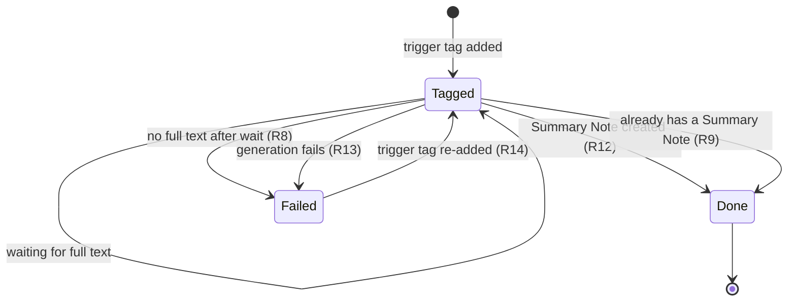
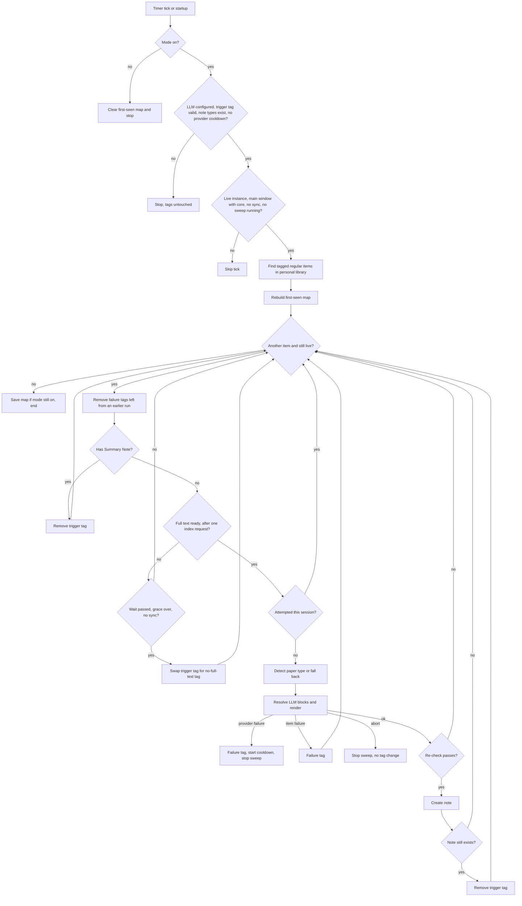

# Automatic Summary Notes for Tagged Items - Plan

## Goal Capsule

- **Objective:** A paper that a coding agent adds to the researcher's Zotero library with a trigger tag already has an AI Summary Note, readable on the iPad, by the time the researcher decides whether to read it, with no one clicking Generate.
- **Means:** An opt-in periodic sweep inside desktop Zotero that reuses the existing detection and Generate pipeline (KTD1, KTD6).
- **Product authority:** This Product Contract. It amends ADR-0001 (LLM calls only through user-triggered actions) for this opt-in mode and keeps ADR-0002's create-once rule. Requirements win on product behavior; KTDs win on mechanism.
- **Execution profile:** Code, Standard depth, five units in dependency order (U1 and U3 can run in parallel).
- **Stop conditions:** Stop and report if the resolve or create steps cannot run from a timer with only `Zotero.getMainWindow()` available, or if writing parent-item tags from the sweep breaks sync in the integration suite.
- **Finishes the work:** The invoking pipeline (implementation, review, PR).
- **Product Contract preservation:** Restructured, no scope change. Outstanding Questions were removed after planning answered them (KTD4, KTD10, KTD12, Assumptions); the file-download assumption was verified against Zotero source; a conflict call-out was added to the tag-outcome Key Decision; a Deferred to Follow-Up Work subsection was added under Scope Boundaries, and the bulk-dialog and Composer boundary now names the shared helpers U3 extracts. The Zotero indexing assumption was corrected after verification against Zotero source (file sync never indexes downloaded PDFs), with no change to requirements or scope.

---

## Product Contract

### Summary

An opt-in automatic mode in desktop Zotero checks for items carrying a trigger tag at startup and every few minutes.
For each tagged item whose PDF has full text, it detects the paper type and creates a Summary Note, which syncs to the iPad.
The tag then records the outcome: removed on success, or swapped for a failure tag when generation fails or full text never arrives.

### Problem Frame

The researcher delegates finding papers to coding agents, which add items and, when available, their PDFs through the Zotero Web API.
The items sync to desktop Zotero and to the iPad, where the researcher reads.
A Summary Note lets them judge in a skim whether a paper is worth a full read, but today one exists only after someone opens the item in desktop Zotero and clicks Generate, or selects it for the bulk dialog.
The iPad app cannot run the plugin, so agent-added papers reach the iPad unsummarized and the triage step the notes exist for does not happen.

### Actors

- A1. Researcher: enables and configures the mode on the desktop; reads and tags items on the iPad.
- A2. Coding agent: adds items, PDFs, and the trigger tag through the Zotero Web API.
- A3. Desktop Zotero with the plugin: runs the sweep and creates Summary Notes.

### Key Decisions

- **Fully automatic once switched on.** Governs R1, R2. (session-settled: user-directed — chosen over queueing tagged items for one-click approval: the researcher is away from the desktop when papers arrive.)
- **A trigger tag selects items.** Governs R4. (session-settled: user-directed — chosen over summarizing every new item with a PDF or every item in a chosen collection: agents can set a tag through the Web API and the researcher can set one on the iPad.)
- **Paper type is detected, falling back to the default note type.** Governs R10. (session-settled: user-directed — chosen over naming the note type in the tag or always using the default note type: no one is present to assign a type.) The bulk dialog keeps blocking unclassifiable items; the fallback applies to automatic runs only.
- **The tag becomes the outcome.** Governs R12, R13, R14. (session-settled: user-directed — chosen over keeping the trigger tag and adding a failure tag, or never touching item tags: a tag is the only signal visible on the iPad.) Conflict call-out: an expired API key or a provider outage turns into a failure tag on the item in flight; KTD7 then pauses the mode for 60 minutes, so at most about one item per hour is tagged while the provider stays broken, and retrying transient provider errors without any tag would change this decision.
- **Full text gets a bounded, configurable wait.** Governs R3, R8. (session-settled: user-directed — chosen over waiting indefinitely: an item added without a PDF would otherwise stay tagged forever.)
- **Existing Summary Notes are never touched.** Governs R9. (session-settled: user-directed — chosen over creating an additional note or overwriting: overwrites keep ADR-0002's explicit-confirmation rule.)
- **A periodic sweep, not event reactions.** Governs R5. (session-settled: user-directed — chosen over an event-driven watcher: a few minutes' delay is acceptable, and a sweep is needed anyway for the wait timeout and catch-up.)
- **Desktop Zotero does the work.** Governs R5. (session-settled: user-directed — chosen over generating summaries while the Mac is closed: desktop Zotero is usually open, and the closed-Mac case is not worth the extra development.)

### Requirements

**Enabling and configuration**

- R1. The automatic mode is off by default and does nothing until the researcher switches it on in Settings.
- R2. While the LLM is not configured, the mode leaves tagged items and their tags untouched.
- R3. Settings lets the researcher change the trigger tag and the full-text wait time, and both have defaults that work unchanged.

**Finding items**

- R4. A paper item carrying the trigger tag is picked up by the mode.
- R5. While desktop Zotero is open, the mode checks for tagged items at startup and then every few minutes, so items tagged while Zotero was closed are handled after the next start.
- R6. Items that already carry the trigger tag when the mode is first switched on are handled like newly tagged items.

**Readiness**

- R7. A tagged item is processed only once its primary PDF has full text; until then it keeps waiting with its tag unchanged.
- R8. An item still without full text once the wait time has passed since the mode first saw it tagged fails with a "no full text" reason, and that first-seen time survives Zotero restarts.

**Generation**

- R9. An item that already has a Summary Note is skipped: no note is created or changed, and the trigger tag is removed.
- R10. The note type comes from paper-type detection on the item; when detection cannot decide, the default note type from Settings is used.
- R11. The Summary Note is produced by the same render, LLM-resolve, and create pipeline as Generate, so it is indistinguishable from a manually generated note.

**Outcome tags**

- R12. On success, the trigger tag is removed from the item.
- R13. On failure, the trigger tag is replaced by a failure tag that tells a "no full text" failure apart from any other failure.
- R14. Adding the trigger tag back to a failed item retries it, and the failure tag is removed when the item is picked up again.
- R15. The reason for each failure is written to the desktop log.

### Key Flows

- F1. Agent-added paper gets summarized
  - **Trigger:** A coding agent adds an item, its PDF, and the trigger tag through the Web API.
  - **Actors:** A2, A3, A1
  - **Steps:** Desktop Zotero syncs the item, downloads the PDF, and indexes its text; the next sweep finds the tagged item with full text; the plugin detects the paper type, creates the Summary Note, and removes the trigger tag; the note syncs to the iPad.
  - **Outcome:** The researcher skims the summary on the iPad before deciding whether to read the paper.
  - **Covered by:** R4, R5, R7, R10, R11, R12
- F2. Failure and retry
  - **Trigger:** A tagged item still has no full text when its wait runs out, or generation fails.
  - **Actors:** A3, A1
  - **Steps:** The plugin swaps the trigger tag for a failure tag; the researcher sees it on the iPad, fixes the cause (for example by attaching a PDF), and re-adds the trigger tag; the next sweep retries the item.
  - **Covered by:** R8, R13, R14, R15

### Acceptance Examples

- AE1. **Covers R7, R8.** Given a wait time of 24 hours and an agent tags an item that has no PDF, when a sweep runs two hours later, the item keeps its trigger tag and gets no failure tag; when a sweep runs more than 24 hours after the mode first saw it, the trigger tag is replaced by the "no full text" failure tag.
- AE2. **Covers R5, R8.** Given Zotero was closed for three days while an agent tagged an item with a PDF, when Zotero starts and indexes the PDF, the item is summarized rather than failed for exceeding the wait.
- AE3. **Covers R9.** Given an item already has a Summary Note and the researcher adds the trigger tag on the iPad, when the sweep runs, no note is created or changed and the trigger tag is removed.
- AE4. **Covers R10.** Given an item has no abstract, so detection cannot decide its paper type, when the item is processed, its Summary Note uses the default note type from Settings.
- AE5. **Covers R13, R14.** Given an item carries the failure tag, when the researcher adds the trigger tag again, the next sweep removes the failure tag and processes the item.
- AE6. **Covers R1.** Given the mode is off, when an agent tags an item, nothing is sent to the LLM and the tag stays.
- AE7. **Covers R2.** Given the mode is on but no LLM base URL or model is set, when a sweep runs, tagged items keep their trigger tag and get no failure tag.

### Scope Boundaries

- A local API endpoint that agents call: agents write through the Web API, so an endpoint would not see their items any sooner.
- Generating summaries while desktop Zotero is closed.
- Summarizing untagged items; an older paper is summarized only once it is tagged.
- Automatically overwriting or adding to an existing Summary Note.
- Changes to the bulk dialog or the Composer beyond the shared helpers U3 extracts.

#### Deferred to Follow-Up Work

- Sweeping group libraries.
- Retrying transient provider errors on a later sweep instead of tagging the item in flight.
- Running the sweep while no Zotero main window is open (macOS keeps Zotero running with the window closed).
- Starting an extra sweep as soon as a sync finishes.

### Dependencies / Assumptions

- Desktop Zotero is usually open while agents add papers.
- Zotero downloads attachment files at sync time: `extensions.zotero.sync.storage.downloadMode.personal` defaults to `on-sync` in Zotero's `defaults/preferences/zotero.js`, and the researcher's profile does not override it. With on-demand download, PDFs never get indexed and every tagged item would time out.
- The plugin asks Zotero's own indexer to index a downloaded PDF that has no full text yet (KTD3), because file sync downloads PDFs without indexing them; the plugin performs no PDF extraction of its own (ADR-0001).
- The LLM provider configured in Settings serves both detection and generation, and the researcher accepts its cost for every tagged item.

### Sources / Research

- `docs/adr/0001-explicit-static-llm-interpreter.md` — LLM calls only through user-triggered actions; amended by this mode.
- `docs/adr/0002-zotero-child-notes-one-way-create-once.md` — create-once, overwrite only after confirmation, Notifier-driven writes deleted.
- `test/integration/startup.spec.js` — asserts no Notifier observer is registered; the sweep adds none.
- `addon/bootstrap.js` `generateSummaryNotes` and `src/paper-type.js` — bulk generation and per-item paper-type detection, including the `no-abstract` reason.
- `addon/bootstrap.js` `existingSummaryNotes` — Summary Notes recognised solely by the marker tag.
- `src/fulltext.js` — full-text reasons `noPrimaryPDF`, `primaryPdfMissing`, `noExtractedText`, `readFailed`.
- `addon/bootstrap.js` `defaultNoteTemplate` — default note type falls back to the first declared note type alphabetically.
- `docs/plans/2026-09-10-1125-feat-bulk-paper-type-detection-plan.md` — bulk detection, including its decision to block unclassifiable items instead of using a default.

---

## Planning Contract

### Key Technical Decisions

- KTD1. **One repeating `nsITimer` drives the sweep, and only the live plugin instance acts.** Create the timer in `init` with `TYPE_REPEATING_SLACK` and a fixed five-minute interval. Before `init` assigns `Zotero.ZON`, cancel the timer held by the previous `Zotero.ZON`, because a hot reload creates a new `ZON` object whose own field is always empty; cancel the timer on the first line of `uninit` too. A sweep is live only while `Zotero.ZON` is this instance and Zotero is not shutting down, and it checks liveness before each item, after every await on the item path, and before every write. Window timers (`win.setTimeout`, the only timer pattern in the repo) die with the window, while Zotero's own auto-sync runner uses this timer pattern. Governs R5. (session-settled: user-directed — chosen over an event-driven Zotero.Notifier watcher: a few minutes' delay is acceptable, and a sweep is needed anyway for the wait timeout and catch-up.)
- KTD2. **Tagged items come from `Zotero.Search` in the personal library.** Conditions: tag `is` the trigger tag, and regular items only (filter with `isRegularItem()`); trashed items are excluded by `Zotero.Search` by default. `Zotero.Tags.getTagItems` was rejected because it returns trashed items, notes, and attachments unfiltered. Governs R4.
- KTD3. **Readiness uses the same full-text read generation uses.** The sweep calls `getPrimaryPDFFulltext(item, C)` and treats `ok` as ready; every reason (`noPrimaryPDF`, `primaryPdfMissing`, `noExtractedText`, `readFailed`) means keep waiting. `Zotero.Fulltext.getIndexedState` was rejected so an item can never look ready and then fail inside the resolve step. When the reason is `noExtractedText` and the primary PDF file exists locally, the sweep asks Zotero's own indexer to index that attachment once per session (`Zotero.Fulltext.indexItems` with errors ignored) and reads again. File sync downloads PDFs but never indexes them: Zotero builds full text only for files imported on this desktop, a manual reindex, or text another client already uploaded, and a PDF an agent uploads through the Web API has none of these. This is Zotero's extraction, not the plugin's, so ADR-0001's no-own-extraction rule holds. Governs R7.
- KTD4. **The first-seen map is one JSON string pref keyed `libraryID/itemKey`.** Each sweep rebuilds it from the currently tagged items (new keys get now, untagged keys drop), an entry is deleted when its item reaches any outcome, and the map is cleared while the mode is off. The sweep writes the map only while the mode is still on, so an in-flight sweep cannot restore entries after the researcher switches the mode off. A file under the Templates folder was rejected because it moves with `templatesDir`, and a new data-directory file would widen the `safeWrite` convention CLAUDE.md scopes to template authoring. Governs R6, R8, R14.
- KTD5. **No timeout decision in the startup grace period or during sync.** A "no full text" failure is only decided when at least 10 minutes have passed since startup and no sync is in progress, so a PDF that arrives with the first sync after a long closure is not failed (AE2). The constant carries a `ponytail:` note naming its ceiling: the grace counts from plugin startup rather than from the first finished sync, and indexing can still run after a sync ends; the upgrade path is to start the grace from the first completed sync. Governs R8.
- KTD6. **The sweep reuses the resolve and create steps headlessly.** It passes `Zotero.getMainWindow()` to `resolveSummaryMdForItem` and `generateSummaryNote`, and the sweep gate also requires `win.ZONCore` and loaded templates, so `generateSummaryNote` never awaits core injection between the KTD9 re-check and its save. When no main window exists, the tick is skipped. `generateSummaryNotes` was rejected for reuse because it reads the UI selection and awaits the bulk dialog. Governs R11.
- KTD7. **Failures are classified before any tag is written.**
  1. Provider failure — a runner `llm.run.httpFailed` result with no HTTP status (network error or timeout) or with status 401, 403, 404, 429, or 5xx, or a detection `http-failed` reason: the item in flight gets the generic failure tag, the sweep stops, and the mode skips sweeps for 60 minutes or until an LLM setting changes.
  2. Item failure — every other runner code, a runner `llm.run.httpFailed` result with any other 4xx status (such as 400 or 413 for an oversized request), and any render error: that item gets the generic failure tag and the sweep continues.
  3. Abort with no tag change — any error while the liveness check fails or the window is closed (a quit cancels in-flight requests, which the runner also reports as `llm.run.httpFailed`), a failure meaning the LLM is not configured or the core bundle is missing, and a detected note type that no longer exists at resolve time.

  The automatic path passes `errorDelayMax: 0` so Zotero's built-in 5xx retry cannot stall a sweep for up to an hour. Governs R2, R13, R15.
- KTD8. **Detection falls back only when it cannot decide.** `no-abstract`, `no-candidate`, and `invalid-answer` use `defaultNoteTemplate()`; `http-failed` is a provider failure under KTD7, so a network blip never fixes the wrong note type into a create-once note. Candidates come from a helper extracted from `openBulkDialog`, so both paths exclude duplicate labels and include inherited built-in declarations (`docs/solutions/architecture-patterns/seed-once-built-in-templates-shadow-new-metadata.md`). A fallback is logged. Governs R10.
- KTD9. **Re-check immediately before each write.** Before creating the note, with no await between the checks and the save, confirm the instance is live, the mode is still on, the item is not deleted, it still carries the trigger tag read at sweep start, and it has no Summary Note. A failed check drops the result without writing, and a Summary Note that appeared meanwhile takes the R9 path. Before the success tag change, confirm the note still exists; if it does not, leave the trigger tag so the next sweep retries. The note is saved first and the tag changes follow in one `saveTx`, so a crash between them self-heals through R9 on the next sweep. Governs R9, R11, R12.
- KTD10. **One sweep at a time, items in series.** A `sweepRunning` flag makes a tick that fires mid-sweep a no-op, and items run one after another while `llmConcurrency` still parallelises blocks within an item. A session-only attempted-set stops an item whose writes failed from paying for another run every tick. Its key is `libraryID/itemKey` plus the `dateModified` read after the last write attempt, and it is checked only after the R9 and readiness checks, right before detection. Any later synced edit to the item changes `dateModified` and allows one more run. Governs R5, R13.
- KTD11. **Automatic-mode failures go to the Error Console with metadata only.** Each failure is logged through `Zotero.logError` and `ZON.log` as title, item key, reason code, and HTTP status. The automatic path never logs `e.message` or `sanitizeError` output, because a provider error body can echo up to 500 characters of the sent full text. `Zotero.debug` alone keeps nothing unless debug output is on. Governs R15.
- KTD12. **The ADR-0001 amendment is a new ADR 0004.** ADR 0001 gains a one-line pointer to it, and `CONTEXT.md` gains the new terms. Governs R1.

### High-Level Technical Design

Sweep gates and per-item path. The Product Contract state diagram shows the item's tag lifecycle; this flowchart shows the order of checks inside one sweep. Liveness (KTD1) is checked at every step that follows an await and before every write; the flowchart shows it only at the item boundary.

### Assumptions

Unvalidated planning bets, made without the researcher's confirmation:

- The mode sweeps only the personal library; group libraries are deferred (items tagged by other group members would otherwise run on this researcher's LLM bill).
- Only one desktop runs the mode per synced library; two desktops seeing the same tag before either syncs would each create a note.
- Defaults: trigger tag `zps:summarize`, failure tags `zps:summarize-failed` and `zps:summarize-no-fulltext`, wait time 24 hours. The sweep interval stays fixed (KTD1) rather than becoming a setting.
- A provider-level failure tags only the item in flight and pauses the mode for 60 minutes (KTD7), so a revoked key or long outage tags at most about one item per hour instead of retrying silently; this keeps R13 as written.
- Anyone with write access to the personal library (a Web API key with write scope, a signed-in device) can trigger paid runs by adding the trigger tag, in any number; this plan documents that and adds no cap.
- A missing note-type set or an invalid trigger-tag setting is a sweep precondition like R2: nothing runs and no tags change.
- The trigger tag matches exactly and case-sensitively; changing it in Settings applies from the next sweep, and items still carrying the old tag are left alone.
- Switching the mode off mid-sweep lets the item in flight finish and starts no further items.
- R15's "desktop log" means the persistent Error Console (KTD11).
- A Composer pane already open on an item does not refresh when an automatic note appears, and a bulk dialog opened before an automatic run can still create a second note from its stale snapshot.

### System-Wide Impact

- **Sync:** the plugin now writes tags on parent items, and those edits sync to the server and to Zotero iOS like any user edit. Zotero merges tag changes per tag, so the plugin removing the trigger tag and an agent adding an unrelated tag merge cleanly. The one real conflict is the plugin removing the trigger tag while the researcher re-adds that same tag on the iPad: either side can win, and the worst outcome is one idle sweep or a retry that needs a second re-tag. Each note save can trigger an auto-sync.
- **Egress and cost:** every tagged item sends its metadata and the primary PDF's full text to the configured provider with no per-item confirmation. A paper whose full text exceeds the max-context setting sends nothing and fails as an item failure (`llm.run.contextTooLarge`, KTD7) until the limit is raised on the desktop; re-tagging alone does not help. Switching the mode on sends the whole existing tagged backlog (R6), one item at a time.
- **Lifecycle:** a timer lives for the whole session, and with the mode off each tick only reads prefs. A hot reload or quit during an LLM call can spend that call without writing anything (KTD1).

### Risks

| Risk | Mitigation |
|---|---|
| Full text of every tagged paper, including the backlog at switch-on, goes to the provider unattended | Settings copy (U2) and README (U5) say so plainly |
| Anyone who can write tags to the library can trigger paid runs, in any number | README treats the trigger tag as trust-sensitive like the API key; serial processing bounds rate, not count |
| Prompt injection inside a PDF steers a note nobody reviews before it syncs | README states automatic notes are unreviewed model output over unvetted PDFs; the mechanism matches manual Generate |
| A bad API key or provider outage fails the item in flight | KTD7 cooldown limits it to about one tagged item per hour; the Error Console records the HTTP status |
| Provider error bodies echo sent full text into the persistent log | KTD11 logs status and reason code only |
| The main window is closed on macOS, so sweeps skip silently | Documented in README; running without a window is deferred |
| A slow first sync or indexing pass outlasts the startup grace | KTD5 ceiling note; the researcher re-tags |
| A tag write fails and the item would re-run every tick | Session attempted-set (KTD10) |
| Every note type lacks a declaration, so detection always falls back | Logged fallback (KTD8); candidates include inherited built-in declarations |

### Sources

- Zotero source (`zotero/zotero`): `chrome/content/zotero/xpcom/data/search.js` (library-scoped search, trashed excluded), `xpcom/data/item.js` (`addTag`/`removeTag` need `saveTx`; `getBestAttachments` is a DB query), `xpcom/fulltext.js` (indexes files imported locally and full text other clients uploaded; `indexItems` indexes on request; the storage download code never calls it), `xpcom/sync/syncRunner.js` (`syncInProgress`, `nsITimer` `TYPE_REPEATING_SLACK` pattern), `xpcom/sync/syncLocal.js` (per-tag merge of tag changes), `defaults/preferences/zotero.js` (`downloadMode` defaults `on-sync`).
- `addon/bootstrap.js` `openBulkDialog` candidate list and `detectFetchFn` with `errorDelayMax: 0` — the patterns U3 extracts and reuses; `init`/`uninit` for the timer lifecycle.
- `src/llm.js` `sanitizeError` — redacts credentials and truncates to 500 characters but keeps body text, which is why KTD11 logs codes only.
- `test/integration/note-types.spec.js` — pref set/restore and ZON method monkeypatching for integration fakes.
- `docs/solutions/architecture-patterns/seed-once-built-in-templates-shadow-new-metadata.md` — detection must see inherited built-in declarations.

---

## Implementation Units

### U1. Pure automatic-mode rules

- **Goal:** Hold every automatic-mode decision that needs no Zotero API as pure, unit-tested functions.
- **Requirements:** R3, R6, R7, R8, R9, R10, R12, R13, R14; KTD4, KTD5, KTD7, KTD8.
- **Dependencies:** None.
- **Files:** Create `src/auto-summary.js` and `test/auto-summary.spec.js`; modify `core/core.js`.
- **Approach:**
  1. First-seen map update per KTD4: given the stored map, the currently tagged keys, and now, return the next map.
  2. Per-item action: given has-Summary-Note, full-text-ready, first-seen, now, wait time, and whether a timeout decision is allowed (KTD5), return skip-existing, wait, fail-no-fulltext, or process.
  3. Note-type choice from one detection result per KTD8: the detected template, the default name, or a provider failure.
  4. Failure class for a resolve failure (code plus HTTP status) per KTD7: provider, item, or abort.
  5. Trigger-tag validation (trimmed, non-empty, different from both failure tags and `zps:summary-note`) and the tag changes for each outcome: success, skip, each failure reason, and pickup.
- **Patterns to follow:** `src/bulk.js` with table-driven `test/bulk.spec.js`; `sanitizeLLMSettings` in `src/llm.js` as the precedent for a pure validator consumed by bootstrap getters; `DETECT_REASONS` in `src/paper-type.js`; `LLM_RUN_ERRORS` in `src/llm-runner.js`.
- **Test scenarios:**
  - A key tagged for the first time enters the map with now; an entry whose item is no longer tagged drops; an existing entry keeps its original time.
  - Covers AE3. Has-Summary-Note returns skip-existing whether or not full text is ready.
  - Covers AE1. No full text 2 hours after first-seen with a 24-hour wait returns wait; 25 hours returns fail-no-fulltext.
  - Covers AE2. No full text, wait passed, timeout not allowed returns wait.
  - Full text ready returns process even when the wait already passed.
  - Covers AE4. Detection `no-abstract` returns the default name; `no-candidate` and `invalid-answer` return the default name; a detected label returns its template; `http-failed` returns a provider failure.
  - Resolve code `llm.run.httpFailed` with no status, 401, 429, or 503 classifies as provider; with 400 or 413 it classifies as item; `llm.run.emptyResponse`, `llm.run.contextTooLarge`, and a render failure classify as item; not-configured, core-missing, and unknown-note-type classify as abort.
  - Tag validation rejects blank and whitespace-only values, a value equal to either failure tag, and `zps:summary-note`; it trims surrounding whitespace.
  - Covers AE5. Success removes the trigger tag and both failure tags; a no-full-text failure removes the trigger tag and adds the no-full-text tag; pickup of an item carrying a failure tag removes that tag and keeps the trigger tag.
- **Verification:** `test/auto-summary.spec.js` passes and the functions are reachable as `win.ZONCore` exports after `npm run build`.

### U2. Settings and prefs

- **Goal:** Add the opt-in switch, trigger tag, and wait time settings, plus the first-seen store.
- **Requirements:** R1, R3, R8; KTD4.
- **Dependencies:** U1.
- **Files:** Modify `addon/bootstrap.js` (`PREF_*`/`DEFAULT_*` pairs, `seedDefaults`, getters, `STRINGS`) and `addon/content/preferences.xhtml`; covered by `test/integration/auto-summary.spec.js` (U4).
- **Approach:**
  1. Four prefs: enabled (default false), trigger tag and wait hours (defaults per Assumptions), first-seen map (default `{}`).
  2. Getters fall back to the default on a missing or invalid value; the trigger-tag getter applies U1 validation and returns an empty string when invalid, which the sweep treats as a precondition failure.
  3. A Settings block for the three user-facing prefs, with copy stating that the mode runs only while desktop Zotero is open and that switching it on sends the full text of every tagged paper to the configured LLM without asking.
  4. Do not copy the auto-run gate that clears its own pref when the LLM is unconfigured; R2 keeps the mode on and idle.
- **Patterns to follow:** `PREF_LLM_CONCURRENCY` end to end (constant pair, `seed` line, getter, label block in `addon/content/preferences.xhtml`).
- **Test scenarios:**
  - A fresh profile reads the mode as off, the trigger tag as the default, and the wait as 24 hours.
  - A non-numeric or negative wait pref reads as 24 hours.
  - A trigger tag pref equal to `zps:summary-note` reads as invalid.
  - A corrupt first-seen pref reads as an empty map.
- **Verification:** The three settings and the egress copy appear in the Settings pane on a dev profile, and the getter scenarios pass.

### U3. Headless pipeline hooks

- **Goal:** Let the automatic path call detection and the resolve step without the bulk dialog and get machine-readable failures.
- **Requirements:** R2, R10, R11, R13; KTD6, KTD7, KTD8.
- **Dependencies:** None.
- **Files:** Modify `addon/bootstrap.js` (`resolveSummaryMdForItem`, `openBulkDialog`); covered by `test/integration/auto-summary.spec.js`.
- **Approach:**
  1. Extract the detection candidate list built inside `openBulkDialog` into a `ZON` helper and have the dialog call it.
  2. Give `resolveSummaryMdForItem` optional fetch options passed through to `makeLLMFetchFn`.
  3. Give every failure return a machine-readable code — the runner `code`, not-configured, core-missing, and errors thrown while rendering or building the bibliography — plus the HTTP status read from the runner's `result.error.status`. The bulk and Composer callers keep their user-visible behavior.
  4. Add a single-item detection helper around `C.detectPaperTypes` that returns its one row result.
- **Patterns to follow:** The per-item try/catch structure of the bulk loop in `generateSummaryNotes`, logging only reason code and HTTP status per KTD11 (never `C.sanitizeError` output or a detection row's `detail` field); `detectFetchFn` built with `errorDelayMax: 0` in `openBulkDialog`.
- **Test scenarios:**
  - The candidate helper returns the four shipped note types with their labels on a fresh profile.
  - A resolve call whose fake fetch throws an error with status 401 returns `ok: false`, code `llm.run.httpFailed`, and status 401.
  - A resolve call whose fake fetch returns an empty completion returns code `llm.run.emptyResponse`.
  - A resolve call with an empty base URL returns the not-configured code instead of only a message.
  - A resolve call for a note type whose render throws returns a render failure code instead of throwing.
  - The single-item detection helper returns `no-abstract` for an item with an empty abstract without calling the fake fetch.
- **Verification:** The scenarios pass, and `test/bulk.spec.js`, `test/paper-type.spec.js`, and a bulk run on a dev profile behave as before.

### U4. Sweep engine

- **Goal:** Run the opt-in sweep on a timer and apply the per-item rules to tagged items.
- **Requirements:** R1, R2, R4–R15; F1, F2; AE1–AE7; KTD1–KTD11.
- **Dependencies:** U1, U2, U3.
- **Files:** Modify `addon/bootstrap.js` (timer lifecycle in `init`/`uninit`, sweep, item processing, `STRINGS`); create `test/integration/auto-summary.spec.js`.
- **Approach:**
  1. Timer lifecycle and liveness per KTD1.
  2. Gates in the High-Level Technical Design order, including the core and templates precondition (KTD6) and the provider cooldown (KTD7); a disabled mode clears the first-seen map.
  3. Find items per KTD2 and rebuild the map through U1.
  4. For each item in series: pickup tag cleanup, the readiness check with its one-time index request (KTD3), the U1 action, the timeout rule (KTD5), the attempted-set check (KTD10), detection and resolve through U3 with `errorDelayMax: 0`, failure classification (KTD7), both re-checks and the write order (KTD9), and logging (KTD11).
  5. Persist the map after each outcome and at the end of the sweep, only while the mode is still on (KTD4).
- **Execution note:** Start with the integration spec for F1 and the gates, calling the sweep function directly instead of waiting for the timer.
- **Patterns to follow:** `test/integration/note-types.spec.js` pref set/restore and ZON method monkeypatching; `generateSummaryNote` marker tagging.
- **Test scenarios** (fakes: `getPrimaryPDFFulltext` and `makeLLMFetchFn` monkeypatched on `Zotero.ZON` and `Zotero.Fulltext.indexItems` stubbed, LLM base URL and model prefs set, prefs, timers, and items restored after each test):
  - Covers F1. A tagged item with an abstract and ready full text gets one Summary Note carrying the marker tag, loses its trigger tag, and has no first-seen entry.
  - Covers AE6. With the mode off, a tagged item keeps its tag and the fake fetch is never called.
  - Covers AE7. With the mode on and an empty base URL, a tagged item keeps its tag, gets no failure tag, and the fake fetch is never called.
  - Covers AE3. A tagged item that already has a Summary Note gets no new note and loses its trigger tag.
  - Covers AE1. An item without full text whose first-seen entry is older than the wait, with the grace period over and no sync running, gets the no-full-text tag in place of the trigger tag and no fetch call.
  - An item without full text inside its wait keeps its tags and its first-seen entry.
  - An item whose PDF file exists but has no full-text cache gets one index request (with `Zotero.Fulltext.indexItems` stubbed to produce the cache) and then a note; a second sweep in the same session makes no further index request for an attachment that still has no text.
  - An item whose wait has passed while a sync is in progress keeps its trigger tag and gets no failure tag.
  - An item whose wait has passed within 10 minutes of startup keeps its trigger tag and gets no failure tag.
  - Covers AE4. An item with an empty abstract gets a note built from the default note type.
  - A fake fetch returning an empty completion puts the generic failure tag on that item, and the next tagged item in the same sweep still gets a note.
  - A fake fetch throwing a network error on the first of two tagged items tags the first as failed and leaves the second with its trigger tag; a second sweep call within 60 minutes processes no item; changing the LLM model pref ends the cooldown.
  - Clearing the base URL during the first of two items leaves the second item's tags unchanged and adds no failure tag to either item.
  - A detected note type deleted before resolve leaves the item's trigger tag and adds no failure tag.
  - Covers AE5. An item carrying both the trigger tag and a failure tag loses the failure tag at pickup and gets a note.
  - A trashed tagged item is not processed.
  - Calling the sweep while a sweep is already running returns without processing any item.
  - Removing the trigger tag inside the fake fetch (mid-resolve) results in no note being created.
  - Making the instance not live inside the fake fetch results in no note and no tag change.
  - Deleting the created note before the success tag write leaves the trigger tag in place.
  - A tag write that throws after the note is created lets the sweep continue; a second sweep in the same session removes the trigger tag through the R9 path without calling the fake fetch.
  - Switching the mode off inside the fake fetch leaves the first-seen pref cleared once the sweep ends.
  - `uninit` cancels the sweep timer, and starting a new instance cancels the timer of the previous `Zotero.ZON`, so a single timer remains.
- **Verification:** The integration spec passes, `test/integration/startup.spec.js` still passes (no Notifier observer), and on a dev profile a tagged item whose PDF arrived by sync gets a note within one interval.

### U5. Docs, ADR, and changelog

- **Goal:** Record the automatic mode and the amended LLM rule where readers and agents look.
- **Requirements:** R1, R3, R13; KTD12.
- **Dependencies:** U4.
- **Files:** Create `docs/adr/0004-opt-in-automatic-summary-notes.md`; modify `docs/adr/0001-explicit-static-llm-interpreter.md`, `CONTEXT.md`, `README.md`, `docs/TEMPLATES.md`, `CHANGELOG.md`, `CLAUDE.md`.
- **Approach:**
  1. ADR 0004 records the opt-in mode as the one exception to user-triggered LLM calls, the sweep over a Notifier observer, and tags as the outcome channel.
  2. ADR 0001 gets a one-line pointer to 0004.
  3. `CONTEXT.md` adds Automatic Mode, Trigger Tag, and Failure Tag, and qualifies "there is no event-driven sync".
  4. `README.md` covers setup (switch, trigger tag, wait), unattended full-text egress, the trigger tag being as trust-sensitive as the API key, automatic notes being unreviewed model output, papers over the max-context limit failing until that limit is raised, the one-desktop assumption, the closed-window limitation, and the file-download-at-sync-time dependency.
  5. `docs/TEMPLATES.md` qualifies its "explicit, never part of normal rendering" statements.
  6. `CHANGELOG.md` gets an `## [Unreleased]` Added entry; `CLAUDE.md` lists ADR 0004.
- **Test expectation:** none -- documentation only.
- **Verification:** No doc statement still claims LLM calls only ever run from a click without mentioning the automatic mode.

---

## Verification Contract

| Check | Command | Proves |
|---|---|---|
| Unit tests | `npm test` | U1 rules; existing suites unchanged |
| New unit spec | `npx vitest run test/auto-summary.spec.js` | U1 in isolation |
| Build | `npm run build` | New `src/` exports bundle into `ZONCore` |
| Integration | `npm run test:zotero` | U2–U4 in headless Zotero, plus the startup spec; needs `.env` and a dev profile, and locally stays in watch mode until stopped after "Test run completed" (CI runs it headless) |
| Manual smoke | Dev profile: switch the mode on, have a PDF uploaded through the Web API and downloaded by sync without opening it, tag the item, wait one interval | F1 end to end with a real sync and the index request; not automatable here |

---

## Definition of Done

- Every requirement R1–R15 is implemented and each AE1–AE7 has a passing test scenario (U1 or U4).
- `npm test`, `npm run build`, and `npm run test:zotero` pass.
- No Zotero Notifier observer is registered and `test/integration/startup.spec.js` is unchanged.
- ADR 0004, `CONTEXT.md`, `README.md`, `docs/TEMPLATES.md`, `CHANGELOG.md`, and `CLAUDE.md` describe the mode.
- The bulk dialog and Composer behave as before, apart from calling the shared helpers U3 extracts.
- Automatic-mode log entries carry status and reason codes only, never provider error bodies or full text (KTD11).
- No abandoned experimental code, debug logging of full text, or unused helpers remain in the diff.
