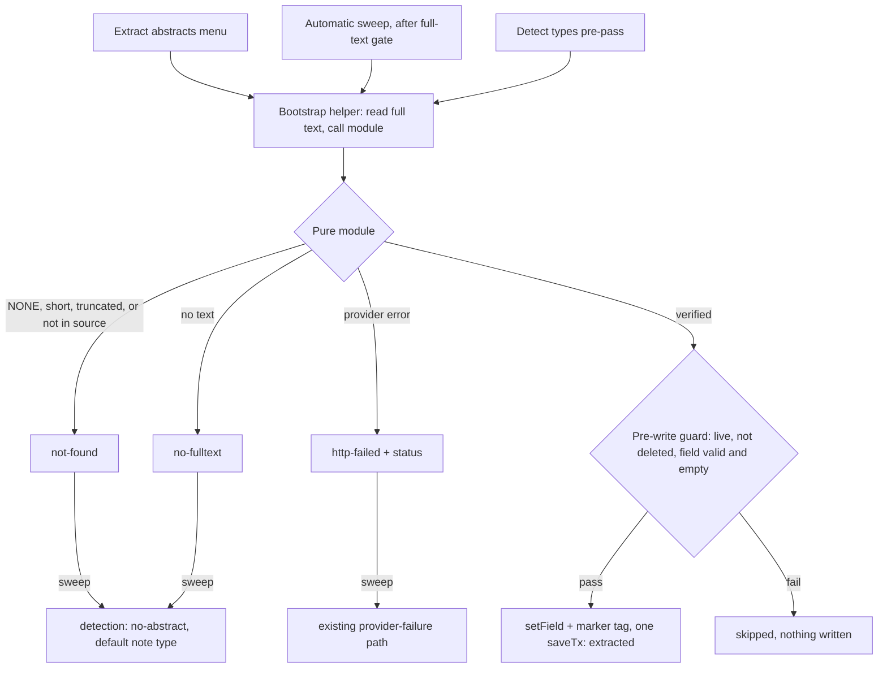

# Extract Missing Abstracts from Full Text - Plan

## Goal Capsule

- **Objective:** Items that arrive without an abstract get the paper's own abstract filled in from the PDF, so paper-type detection picks a real note type for them instead of falling back to the default.
- **Means:** A pure extraction module that asks the LLM for the abstract and checks it against Zotero's indexed text (KTD1, KTD2), behind one shared write helper that all three triggers call (KTD3).
- **Product authority:** This Product Contract. ADR-0001 (explicit, BYOK LLM calls; no own PDF extraction) and ADR-0004 (the opt-in automatic mode) still bind; the new metadata write is recorded as ADR-0005 (KTD9). Requirements win on product behavior; KTDs win on mechanism.
- **Execution profile:** Code, Standard depth, five units in dependency order (U3 and U4 can run in parallel after U2).
- **Stop conditions:** Stop and report if Zotero's full-text cache turns out to lack the opening pages for ordinary PDFs (so no slice can contain the abstract), or if writing `abstractNote` from the sweep breaks the existing auto-summary integration suite in a way the plan does not predict.
- **Finishes the work:** The invoking pipeline (implementation, review, PR).
- **Product Contract preservation:** Restructured, no scope change. The Outstanding Questions section was removed after planning answered each question (KTD2 text length and containment tolerance, KTD8 tag constant, KTD6 menu visibility, KTD9 ADR, KTD4/KTD5 concurrency and liveness). The fourth Key Decision's link was corrected from `Governs R8, R9` to `Governs R9, R10`, the two implicit triggers it covers.

---

## Product Contract

### Summary

When an item has no abstract, the plugin sends the beginning of the PDF text Zotero has already indexed to the user's LLM, asks for the paper's own abstract word for word, and saves it to the item only if that text really appears in the paper. A tag marks every abstract filled in this way. Extraction runs from a new "Extract abstracts" item-menu action, and on its own inside Automatic Summary Notes and the bulk dialog's "Detect types".

### Problem Frame

Paper-type detection reads only the item's abstract. An item with an empty abstract never reaches the model: detection reports "no abstract", the automatic sweep silently uses the default note type, and the bulk dialog asks the user to pick a template by hand. Items that coding agents add, or that come from sources with thin metadata, often lack an abstract even though the PDF opens with one. Those are exactly the items the automatic mode is meant to handle unattended, so they end up with the wrong note type.

### Key Decisions

- **The abstract is saved to the item, not just used for detection.** A filled Abstract field syncs and helps the iPad, citations, and other tools too. (session-settled: user-directed — chosen over detection-only fallback that leaves metadata alone, and over a split between automatic detection-only and a separate writing action: the saved abstract is wanted in its own right.) Governs R1, R4.
- **Verbatim only; never generated.** An AI summary in the Abstract field would pass as publisher metadata. (session-settled: user-directed — chosen over "verbatim, else a generated abstract" and over "always generated": the field must hold the paper's own words.) Governs R2, R3.
- **The LLM finds the abstract; the plugin checks it against the source.** This works across layouts and costs one short call per item; the containment check turns "verbatim" into a guarantee. (session-settled: user-directed — chosen over an "Abstract"-heading text heuristic without an LLM, which misses many layouts, and over LLM-returned start/end anchors cut from the source, which break on hyphenation and ligatures.) Governs R1, R2.
- **Extraction runs on its own in the automatic sweep and in "Detect types", besides the manual action.** Both are LLM-calling steps the user already opted into. (session-settled: user-directed — chosen over "automatic sweep only" and "manual action only".) Governs R9, R10.
- **A tag marks extracted abstracts.** It is visible on every device, filterable, and removable, and it keeps the abstract text itself clean. (session-settled: user-directed — chosen over no marking and over a line in the Extra field.) Governs R5.

### Requirements

**Extraction**

- R1. When an item has no abstract, the plugin sends the beginning of the Zotero-indexed full text of the item's primary PDF to the user's configured LLM and asks for the paper's own abstract, copied word for word.
- R2. The plugin writes the returned text to the item's Abstract field only if it appears in the source text, tolerating differences in whitespace and line-break hyphenation; otherwise it writes nothing and reports "no abstract found".
- R3. When the model reports that the paper has no abstract, nothing is written; the plugin never writes a summary or any model-authored text to the Abstract field.
- R4. An item that already has a non-empty abstract is never extracted for and never overwritten.
- R5. Every abstract the plugin writes comes with a marker tag on the item (working name `zps:abstract-extracted`).
- R6. Extraction reads only text Zotero has already indexed and does no PDF parsing or OCR of its own; an item with no PDF, or whose PDF is not indexed, reports "no full text" and gets nothing written.
- R7. Extraction needs the user's configured LLM; with none configured, the manual action says an LLM must be set up first, and the two automatic paths behave exactly as they do today.

**Where extraction runs**

- R8. A new item-menu action, "Extract abstracts", runs extraction for the selected regular items and ends with a summary of how many were extracted, had no abstract found, had no full text, failed, or were skipped because they already had one. It appears in the same item menu as "Find DOI".
- R9. Automatic Summary Notes extracts an abstract before paper-type detection whenever the item has none, so detection runs on the extracted abstract.
- R10. The bulk dialog's "Detect types" extracts abstracts for rows that lack one before detecting their types; a row where extraction found nothing keeps today's "No abstract" reason.

**Outcomes in the automatic sweep**

- R11. In the automatic sweep, "no abstract found" and "no full text" from extraction lead to today's no-abstract behavior (the default note type), not to the failure tag.
- R12. An LLM provider failure during extraction in the automatic sweep follows the sweep's existing provider-failure path, including its failure tag.

### Acceptance Examples

- AE1. **Covers R4.** **Given** a selected item with a publisher abstract, **when** the user runs "Extract abstracts", **then** no LLM call is made for it, its abstract is unchanged, and the summary counts it as skipped.
- AE2. **Covers R2.** **Given** the model returns a paraphrase that does not appear in the indexed text, **when** extraction finishes, **then** the Abstract field stays empty, no marker tag is added, and the item is reported as "no abstract found".
- AE3. **Covers R3, R11.** **Given** a tagged commentary with no abstract on its first pages, **when** the automatic sweep processes it, **then** nothing is written to its Abstract field and it gets a Summary Note of the default note type, without the failure tag.
- AE4. **Covers R12.** **Given** the LLM provider returns an error during extraction in the automatic sweep, **then** the item gets the sweep's failure tag in place of its trigger tag, and no note is created.
- AE5. **Covers R10, R2, R5.** **Given** the bulk dialog lists an item without an abstract whose PDF begins with one, **when** the user clicks "Detect types", **then** the item gets the abstract and the marker tag, and its row shows a detected note type instead of "No abstract".

### Scope Boundaries

- Generated or summarized abstracts for papers that have none of their own.
- OCR of scanned PDFs, or reading PDFs without Zotero's full-text index.
- Overwriting or "improving" an abstract that already exists.
- Filling other metadata fields (keywords, authors, dates) from the full text.

### Dependencies / Assumptions

- Zotero's index stores the full text without page breaks, so "the first two or three pages" becomes "the first part of the indexed text, sized to roughly cover the opening pages". An abstract that starts after that portion is reported as "no abstract found".
- "Detect types" in the bulk dialog now writes to items: abstracts and marker tags are saved, and they sync. Until now that click only read items.
- The automatic sweep already waits for the PDF's full text to be indexed before it detects the paper type, so extraction there has its input.

### Sources / Research

- `src/paper-type.js`: an empty abstract makes detection emit `no-abstract` before any model call.
- `src/auto-summary.js` (`chooseNoteType`): `no-abstract` falls back to the default note type; only `http-failed` becomes a provider failure.
- `src/fulltext.js` (`resolvePrimaryPDFFulltext`) and `getPrimaryPDFFulltext` in `addon/bootstrap.js`: full text comes only from Zotero's full-text cache file, with a rule never to log it.
- `addon/bootstrap.js` (`findDOIsForItems`, `findDOIForItem`): the "Find DOI" item-menu action is the precedent for a bulk action that writes a regular-item field and never overwrites a value; `addItemMenu` puts both item actions in the first item menu it finds.
- `addon/bootstrap.js` (bulk dialog `Detect types` handler, `detectPaperTypeForItem`): the only two callers of paper-type detection.
- `docs/adr/0001-explicit-static-llm-interpreter.md`, `docs/adr/0004-opt-in-automatic-summary-notes.md`: no own PDF extraction; the automatic mode's exception to user-triggered LLM calls.
- `docs/plans/2026-09-10-1125-feat-bulk-paper-type-detection-plan.md`, `docs/plans/2026-09-13-1636-feat-auto-summary-notes-plan.md`: the detection and automatic-mode features this work extends.

---

## Planning Contract

### Key Technical Decisions

- KTD1. **A new pure module, `src/abstract-extract.js`, modeled on `src/paper-type.js`.** It owns the prompt, the answer parsing, the containment check, the reason codes (`no-fulltext`, `not-found`, `http-failed`) and the marker tag constant. Its entry point is a single-item `extractAbstract(text, settings, fetchFn)` that returns an outcome; callers that handle several items run the KTD3 helper under `runBounded` at the settings' concurrency, so all three triggers share one throttle. It reuses the `src/llm.js` builders (`sanitizeLLMSettings`, `buildChatCompletionsURL`, `buildLLMHeaders`, `buildChatCompletionsPayload`, `parseChatCompletionsResponse`, `sanitizeError`) and keeps a numeric HTTP status on `http-failed` the way detection does. It is re-exported from `core/core.js`, together with `runBounded` from `src/llm-pool.js`, which bootstrap cannot reach today. Governs R1, R2, R3.
- KTD2. **The input is the first 12,000 characters of the indexed text, and the check is normalized containment with a length floor.**
  1. The slice is `min(12000, maxContextChars)` characters from the start of the text `getPrimaryPDFFulltext` returns. That covers the opening two to three pages of a typical article. The constant carries a `ponytail:` note: it approximates pages because the cache has no page breaks, and the upgrade path is a page-aware slice if Zotero ever exposes one.
  2. The prompt asks for the abstract copied exactly, or the single word `NONE`. The parser checks for `NONE` first, then strips wrapping quotes and a leading "Abstract" label.
  3. Containment compares NFKC-normalized text (which folds ligatures such as "fi"), with line-break hyphenation removed ("-" followed by whitespace), soft hyphens removed, and all whitespace collapsed. The comparison is case-sensitive.
  4. An answer shorter than 20 words is `not-found`, so a running header or journal name can never pass as an abstract.
  5. A truncated answer is `not-found`. A reply whose `finish_reason` is `length` counts as truncated; the module reads the raw response for this because `parseChatCompletionsResponse` drops it. So does an answer whose match ends within the last 200 normalized characters of a slice that is shorter than the whole text, because the abstract may continue past the cut. Otherwise a prefix of the abstract would pass containment and, under R4, never be replaced.
  6. The written value is the parsed answer with whitespace collapsed, which the check has proven matches the source.

  Governs R2, R3.
- KTD3. **One bootstrap helper extracts for one item and writes, and every trigger calls it.**
  1. It reads the full text through `getPrimaryPDFFulltext`; the sweep passes in the text it already read.
  2. It calls the pure module and, on a verified answer, writes through a guard with no await between the check and the save: the plugin instance is live, the item is not deleted, the `abstractNote` field is valid for the item type and still empty.
  3. The write is `setField("abstractNote")` plus `addTag(ABSTRACT_TAG)` in a single `saveTx`, so R5's tag can never be missing from a written abstract.
  4. A failed guard drops the result without writing.
  5. The helper returns an outcome of `extracted`, `not-found`, `no-fulltext`, `skipped`, or `http-failed` with its status.

  Governs R2, R4, R5, R6.
- KTD4. **The sweep extracts inside `autoSummaryProcess`, after the full-text readiness gate and before detection.**
  1. `autoSummaryItem` passes on the full text it already holds.
  2. When the item's abstract is empty, the sweep runs the helper with the same `fetchExtra` (`errorDelayMax: 0`), then re-checks liveness.
  3. An `http-failed` outcome is logged as `extract.httpFailed` with its status and fed into the existing provider-failure path: failure tag, sweep stop, 60-minute cooldown for the whole mode, the same as a detection failure.
  4. `not-found` and `no-fulltext` fall through to detection, which then reports `no-abstract` and uses the default note type.
  5. The item's `dateModified` changes when an abstract is saved; this is harmless because the session's attempted-set key is read after the last write.

  Governs R9, R11, R12.
- KTD5. **"Detect types" runs an extraction pre-pass, and detection starts only when the pre-pass has finished.**
  1. The pre-pass covers rows whose item has an empty abstract.
  2. It uses the dialog's `detectFetchFn`, so closing the dialog cancels extraction requests, and the same `shouldStop`, so a second click supersedes the first.
  3. Row status reads "Extracting abstract…".
  4. After the pre-pass, the detection payload re-reads `abstractNote` from each item.
  5. A row whose extraction returns `http-failed` shows detection's existing request-failed reason and is left out of detection.
  6. The pre-pass runs the KTD3 helper under `C.runBounded` with the settings' concurrency. Running the two steps one after the other keeps that setting as the only throttle.

  The bulk dialog does not trigger Zotero indexing; unindexed PDFs report no full text (R6). Governs R10.
- KTD6. **The menu action follows "Find DOI".**
  1. A new item-menu entry is registered in `addItemMenu` and added to `win._zonItemMenu.items`, so `removeItemMenu` cleans it up.
  2. `updateItemMenu` hides it when no selected item has an empty, valid Abstract field, and gives it a singular or plural label.
  3. Selection is pre-filtered, and items that already have an abstract count as skipped.
  4. The LLM-configured check fires only when at least one item needs extraction, and it shows `err.llmNotConfigured`.
  5. Items run through the KTD3 helper under `C.runBounded` at the settings' concurrency with a progress window, and a summary popup reports the R8 counts.
  6. Item types without an Abstract field are skipped, because `Zotero.ItemFields.isValidForType` rejects them.

  Governs R4, R7, R8.
- KTD7. **Extraction logs metadata only.** Log title, item key, reason code, and HTTP status. Never log the full text, the model's answer, `e.message`, or `sanitizeError` output, because a provider error body can echo the sent text. This matches the sweep's existing logging rule. Governs R12.
- KTD8. **The marker tag is a fixed constant, `zps:abstract-extracted`, not a setting.** This matches how the sweep's failure tags are constants. `sanitizeTriggerTag` also rejects it, so a trigger tag can never collide with it. Governs R5.
- KTD9. **A new ADR 0005 records the metadata write.** It says that an explicit or opted-in LLM step may write `abstractNote` and its marker tag on a regular item, verbatim only, reading only Zotero's own index. ADR 0001 gains a one-line pointer to it. The comments that describe "Detect types" as read-only are updated. Divergence from the bulk-detection plan's rule that nothing is persisted on the item is deliberate: detection results still are not stored; only the extracted abstract is. Governs R1, R10.

### High-Level Technical Design

The three triggers share one helper; the pure module decides the outcome and the helper alone writes.

### Assumptions

- The first 12,000 characters of the indexed text contain the abstract for most articles; front matter that runs longer reports `not-found`.
- A 20-word floor is long enough to reject headers and short enough to accept brief abstracts.
- Case-sensitive containment is safe because the prompt asks for an exact copy; a model that changes case produces `not-found`, which writes nothing.
- The manual action does not ask Zotero to index unindexed PDFs; it reports them as no full text, as R6 states.
- An abstract written while a Composer preview is open for that item needs no special handling; the preview shows the new field on its next render.

### System-Wide Impact

- "Detect types" and the sweep now write item metadata that syncs to every device; the README must say so.
- The bulk dialog now sends PDF full text to the provider for rows without an abstract, where it previously sent only title and abstract.
- In the sweep, a provider error on a no-abstract item now pauses the mode for 60 minutes; before, such items made no call at all.

### Risks

- **Ligature or encoding quirks beyond NFKC** can make a correct abstract fail containment. The only effect is `not-found`, never a wrong write. The unit tests fix the normalization cases the plan names.
- **The existing sweep test "refused connection (HTTP status 0) at resolve on no-abstract items"** rests on "no abstract, so detection makes no request". Extraction now makes that request. U3 updates its premise and the code it expects to be logged.

---

## Implementation Units

### U1. Pure extraction module

- **Goal:** Decide, without Zotero, whether an LLM answer is the paper's verbatim abstract.
- **Requirements:** R1, R2, R3; KTD1, KTD2, KTD8.
- **Dependencies:** None.
- **Files:** Create `src/abstract-extract.js`, `test/abstract-extract.spec.js`. Modify `core/core.js`, `src/auto-summary.js` (`sanitizeTriggerTag` exclusion).
- **Approach:**
  1. Export the prompt builder, the answer parser, the normalizer and containment check, `extractAbstract`, the reason codes, the slice constant, and `ABSTRACT_TAG`. Re-export `runBounded` from `core/core.js`.
  2. Build `extractAbstract` from the `detectPaperTypes` pieces. Empty text returns `no-fulltext` without a call; a fetch rejection returns `http-failed` with the numeric status or null.
  3. Add `ABSTRACT_TAG` to the tags `sanitizeTriggerTag` rejects.
- **Patterns to follow:** `src/paper-type.js` and `test/paper-type.spec.js` (`makeFetch`, `vi.fn` call counts); `src/crossref.js` `normalizeTitle` for how normalization is kept pure.
- **Test scenarios:**
  - An answer copied exactly from the source is verified, and the written value has collapsed whitespace.
  - Covers AE2. A paraphrase absent from the source is `not-found`.
  - Source text with "clas- sification" split across a line, a soft hyphen, and a "fi" ligature matches a clean answer.
  - An answer wrapped in quotes or prefixed "Abstract:" is stripped and verified.
  - `NONE` is `not-found` even when the source contains the word "NONE".
  - A 12-word answer found in the source is `not-found` (length floor).
  - A row with empty text is `no-fulltext`, and `fetchFn` is not called.
  - A fetch rejection carrying status 429 yields `http-failed` with status 429; one without a status yields null.
  - The payload's user message holds at most `min(12000, maxContextChars)` characters of source.
  - A reply with `finish_reason: "length"` is `not-found` even when its text is in the source.
  - An answer whose match ends within the last 200 characters of a slice shorter than the whole text is `not-found`; the same answer on a text that fits whole in the slice is verified.
  - `sanitizeTriggerTag("zps:abstract-extracted", …)` returns "".
- **Verification:** `npx vitest run test/abstract-extract.spec.js` passes and `npm run build` bundles the new exports.

### U2. Shared helper and the "Extract abstracts" menu action

- **Goal:** Write verified abstracts safely and let the user run extraction on a selection.
- **Requirements:** R4, R5, R6, R7, R8; KTD3, KTD6, KTD7.
- **Dependencies:** U1.
- **Files:** Modify `addon/bootstrap.js` (helper, write guard, `itemAbstractState`, menu entry, `updateItemMenu`, `STRINGS`). Create `test/integration/abstract-extract.spec.js`.
- **Approach:**
  1. `itemAbstractState(item)` returns `has`, `unsupported`, or `missing`, mirroring `itemDoiState`.
  2. The helper and write guard follow KTD3. The menu flow follows KTD6 and reuses `progress`, `finishProgress`, and `popup`.
  3. New strings go in `STRINGS`: the menu label singular and plural, a none-missing message, the summary, and the row status used by U4.
- **Patterns to follow:** `findDOIsForItems` / `findDOIForItem` / `itemDoiState`; the sweep's KTD9 pre-write re-check in `autoSummaryProcess`; `makeLLMFetchFn` as the test seam.
- **Test scenarios:**
  - Covers AE1. An item with an abstract is skipped with no fetch call, and its abstract is unchanged.
  - An item whose PDF text contains the abstract gets it written plus the `zps:abstract-extracted` tag.
  - Covers AE2. A paraphrasing reply writes nothing and adds no tag.
  - An item with no PDF, or with unindexed text, is counted as no full text.
  - An abstract that another write set while the call was in flight is not overwritten (the guard re-reads the field).
  - An item trashed while the call was in flight gets nothing written.
  - With no LLM configured and one item missing an abstract, the action shows the not-configured message and makes no call.
  - The menu entry is hidden when every selected item already has an abstract.
  - A stop signal (window closed) during a multi-item run stops further calls under `runBounded`.
- **Verification:** The integration spec passes under `npm run test:zotero`, and the summary counts match the scenarios.

### U3. Extraction in the automatic sweep

- **Goal:** Tagged items without an abstract get one before their type is detected.
- **Requirements:** R9, R11, R12; KTD4, KTD7.
- **Dependencies:** U2.
- **Files:** Modify `addon/bootstrap.js` (`autoSummaryItem`, `autoSummaryProcess`) and `test/integration/auto-summary.spec.js`.
- **Approach:**
  1. Thread the already-read full text into `autoSummaryProcess`.
  2. Insert the helper call before `detectPaperTypeForItem`, following KTD4.
  3. Map `http-failed` onto the existing provider-failure branch with the code `extract.httpFailed`.
- **Patterns to follow:** the existing provider-failure branch and the `PATCHED` / `reply(payload)` stubs in `test/integration/auto-summary.spec.js`; tell extraction payloads from detection payloads by their system prompt.
- **Test scenarios:**
  - A tagged item without an abstract whose text contains it gets the abstract, the marker tag, and a note of the detected type (detection receives the extracted abstract).
  - Covers AE3. A `NONE` reply writes no abstract and produces a default-type note without the failure tag.
  - Covers AE4. A rejected extraction request with status 429 logs `extract.httpFailed` with 429, puts the failure tag in place of the trigger tag, creates no note, and pauses the mode.
  - An item that already has an abstract makes no extraction call.
  - The existing HTTP-status-0 test is updated: the failing request is now the extraction call, and it still ends in the provider-failure outcome.
  - The existing AE4 test of the earlier plan (default type when detection cannot decide) stays green.
- **Verification:** The whole auto-summary integration suite passes.

### U4. Extraction pre-pass in "Detect types"

- **Goal:** Bulk-dialog rows without an abstract get one before detection.
- **Requirements:** R10; KTD5.
- **Dependencies:** U2.
- **Files:** Modify `addon/bootstrap.js` (bulk dialog Detect-types handler and its comments).
- **Approach:**
  1. Before building the detection payload, run the helper over rows with an empty abstract, following KTD5.
  2. Update the rows' status as each finishes.
  3. Rebuild the payload from the items afterwards.
- **Patterns to follow:** the handler's existing `seq` guard, `shouldStop`, `detectFetchFn`, and `reasonText` mapping.
- **Execution note:** The bulk dialog has no integration harness. The shared logic is proven in U1 and U2, so check this unit with a manual smoke run on a dev profile rather than building a dialog harness.
- **Test expectation:** No automated test. The pre-pass wires tested pieces together inside a dialog that has no harness. The manual smoke check in the Verification Contract covers AE5.
- **Verification:** On a dev profile, an item without an abstract whose PDF is indexed shows "Extracting abstract…", then a detected type. Closing the dialog mid-run cancels in-flight requests without writing.

### U5. Docs, ADR, and changelog

- **Goal:** Record the new metadata write and the three triggers where readers and agents look.
- **Requirements:** R1, R8, R9, R10; KTD9.
- **Dependencies:** U3, U4.
- **Files:** Create `docs/adr/0005-extract-missing-abstracts.md`. Modify `docs/adr/0001-explicit-static-llm-interpreter.md`, `README.md`, `docs/TEMPLATES.md`, `CONTEXT.md`, `CHANGELOG.md`, `CLAUDE.md`.
- **Approach:**
  1. ADR 0005 per KTD9, and ADR 0001 gets a pointer to it.
  2. `README.md` gains an "Extract abstracts" bullet next to Find DOI. Its automatic-mode section says that extraction runs first and sends full text.
  3. `docs/TEMPLATES.md` (bulk auto-detection) says that "Detect types" may fill missing abstracts.
  4. `CONTEXT.md` defines the Abstract Marker Tag.
  5. `CHANGELOG.md` gets an `## [Unreleased]` Added entry, and `CLAUDE.md` lists ADR 0005.
- **Test expectation:** none -- documentation only.
- **Verification:** No doc still describes "Detect types" as sending only title and abstract, or says the plugin never writes item metadata other than DOI.

---

## Verification Contract

| Check | Command | Proves |
|---|---|---|
| Unit tests | `npm test` | U1; existing suites unchanged |
| New unit spec | `npx vitest run test/abstract-extract.spec.js` | U1 in isolation |
| Build | `npm run build` | New `src/` exports bundle into `ZONCore` |
| Integration | `npm run test:zotero` | U2 and U3 in headless Zotero; needs `.env` and a dev profile; stop the watcher after "Test run completed" when run locally |
| Manual smoke | Dev profile: run "Extract abstracts" on an item with an indexed PDF and no abstract, and click "Detect types" in the bulk dialog on another | U2 end to end with a real provider; U4 and AE5 |

---

## Definition of Done

- R1–R12 are implemented, and AE1–AE4 each have a passing automated test (U1–U3); AE5 is checked by the manual smoke run.
- `npm test`, `npm run build`, and `npm run test:zotero` pass.
- No code path writes `abstractNote` except the KTD3 helper, and it never overwrites a non-empty value.
- Extraction log entries carry title, key, reason code, and status only (KTD7).
- ADR 0005, `README.md`, `docs/TEMPLATES.md`, `CONTEXT.md`, `CHANGELOG.md`, and `CLAUDE.md` describe the feature.
- No abandoned experimental code, debug logging of full text or model answers, or unused helpers remain in the diff.
