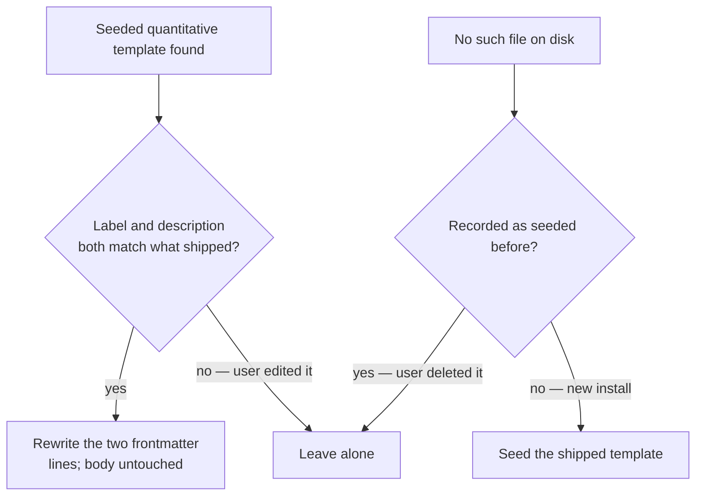
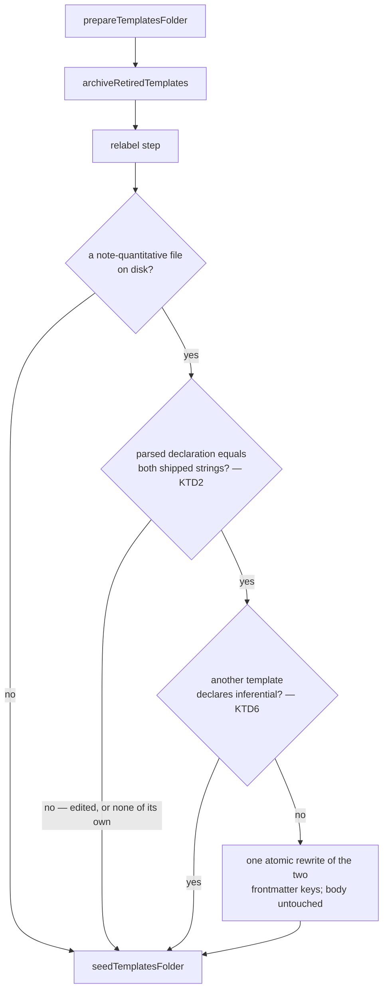

# A Note Type for Descriptive and Exploratory Papers - Plan

## Goal Capsule

**Objective:** A quantitative paper that describes or explores, rather than tests hypotheses, gets a Summary Note whose sections fit what it actually reports — and type detection can tell the two kinds of paper apart.

**Product authority:** This Product Contract, from the brainstorm dialogue of 2026-09-20. Originating issue: [#60](https://github.com/klueserthan/obsidian-notepad-for-zotero/issues/60).

**Open blockers:** None.

## Product Contract

### Summary

Ship a fifth built-in Note Type for quantitative papers that report patterns instead of testing hypotheses, with sections built around data, measures and patterns rather than variables and effects. Rename the existing `quantitative` type to `inferential` so the two labels name a real opposition, and carry that rename into existing libraries by rewriting the declaration in place, leaving the template body alone.

### Problem Frame

Every quantitative paper is detected as the one `quantitative` Note Type, whose template assumes a confirmatory study: it asks for Hypotheses, for a variables table split into independent, dependent, moderator and mediator, and for findings reported with effect direction and statistical significance (`addon/bootstrap.js:104-138`).

Descriptive and exploratory papers have none of that. Asked for hypotheses a paper never stated, the LLM either returns an empty section or invents one — and an invented hypothesis in a Summary Note is worse than a missing section, because nothing downstream marks it as fabricated.

The labels make this hard to fix by adding a type alone. A descriptive paper *is* quantitative, so a `quantitative` / `descriptive` pair gives the classifier two labels that overlap, and detection sees only the label and its one-line description (`src/paper-type.js:42-58`).

### Key Decisions

- **One new type covers both descriptive and exploratory papers.** They share the property that decides the template: nothing to state as a hypothesis, nothing to confirm or reject. (session-settled: user-directed — chosen over splitting descriptive from exploratory, and over making the existing template degrade when hypotheses are absent: a single boundary is easier for the classifier to hold than two adjacent ones.) Governs R1.
- **The new template is organized around data and patterns, not variables and effects.** (session-settled: user-directed — chosen over mirroring the inferential template minus its hypothesis parts, and over a lean four-section version: a descriptive paper's substance is its measures and what they show.) Governs R2, R3.
- **The existing type is renamed rather than just narrowed.** Detection reads labels alongside descriptions, so leaving an overlapping label in place would undercut the split the new type exists to make. (session-settled: user-directed — chosen over keeping `quantitative` and narrowing only its description: the rename costs a migration, the overlap costs every classification.) Governs R5, R6.
- **Existing libraries are migrated by rewriting the declaration in place.** The two frontmatter lines change; the body does not, so a user's own edits to the sections survive. (session-settled: user-approved — chosen over a documented manual relabel and over letting the old and new types coexist: a stale overlapping type in the user's own library would defeat R6 until they acted on it.) Governs R8, R9.

### Requirements

**The new Note Type**

- R1. The plugin ships a fifth built-in Note Type covering quantitative papers that report patterns, distributions, trends or exploratory analysis without stating hypotheses.
- R2. Its LLM sections capture the paper's aim or research questions, its data and measures, its analytic approach, the main patterns it reports, and the authors' interpretation and caveats.
- R3. That template states no hypotheses section and does not frame findings as effects with a direction or a significance level.
- R4. Its non-LLM parts — citation line, Zotero and PDF links, abstract block, free-text Notes, annotations block — match the other built-in templates.

**Telling the two types apart**

- R5. The existing `quantitative` Note Type is renamed to `inferential`, and its description narrowed to studies that state and test hypotheses.
- R6. The two descriptions each name the property that separates them, because detection classifies from the paper's title and abstract against the label-and-description list alone (`src/paper-type.js:42-58`).
- R7. The `inferential` template's sections are unchanged; only its declaration moves.

**Existing installations**

- R8. On upgrade, a seeded `quantitative` template whose label and description both still match what shipped is relabelled in place, with its body left byte-identical.
- R9. Any other state is left untouched: a declaration the user already edited, a template they wrote themselves carrying that label, or a shipped template they deleted.
- R10. A migrated template keeps its role: if the migration changes anything the default-template preference names, the preference follows it, so the user's configured default survives (the Template Builder's rename path already does this, `addon/bootstrap.js:3732`).
- R11. The migration is idempotent — a second startup after it ran changes nothing.
- R12. A fresh install seeds the full set of built-in types directly, with no migration step.

### Key Flows

- **Upgrading an existing library**
  - **Trigger:** Zotero starts with the new plugin version; the templates folder holds the four previously seeded files.
  - **Steps:** The new descriptive template is absent from disk and from the seeded record, so it is written. The `quantitative` template is inspected; its declaration still matches what shipped, so its label and description are rewritten and its body left alone. The default-template preference is re-pointed if it named that file.
  - **Outcome:** The folder offers `inferential` and `descriptive` as distinct types, the user's edits to template bodies survive, and no type named `quantitative` remains. Covers R8, R10, R12.

- **Detecting a descriptive paper**
  - **Trigger:** The user runs "Detect types" in the bulk dialog, or Automatic Mode sweeps a tagged item.
  - **Steps:** Both paths call the same detection (`src/paper-type.js`), which sends the item's title and abstract with the numbered candidate list built from the declared types in the folder.
  - **Outcome:** A paper whose abstract reports distributions or trends without hypotheses is matched to `descriptive`; one that states and tests hypotheses is matched to `inferential`. Covers R6.

### Acceptance Examples

- AE1. **Covers R8.** Given a library seeded by an earlier version whose `quantitative` template is untouched, when the plugin starts, then the template declares `inferential` with the narrowed description and every byte below the frontmatter is unchanged.
- AE2. **Covers R9.** Given a user who relabelled or reworded that template's declaration themselves, when the plugin starts, then the file is not modified.
- AE3. **Covers R9.** Given a user who deleted the shipped `quantitative` template, when the plugin starts, then it is not recreated.
- AE4. **Covers R11.** Given the migration already ran, when Zotero restarts, then no template file is written.
- AE5. **Covers R12.** Given an empty templates folder, when the plugin starts, then it seeds every built-in type including `descriptive`, and no relabelling occurs.
- AE6. **Covers R6.** Given an item whose abstract reports vote-share trends across three decades with no stated hypothesis, when detection runs, then it returns `descriptive`.
- AE7. **Covers R6.** Given an item whose abstract states hypotheses and reports coefficients with significance levels, when detection runs, then it returns `inferential`.
- AE8. **Covers R10.** Given the default-template preference names the migrated template, when the plugin starts, then it still resolves to that template and the Composer opens on it.

### Scope Boundaries

- Tagging Summary Notes with their Note Type — that is [#59](https://github.com/klueserthan/obsidian-notepad-for-zotero/issues/59), and the rename here lands before any type label reaches a tag.
- Widening what detection reads. It sees title and abstract only; filling a missing abstract from the PDF is [PR #58](https://github.com/klueserthan/obsidian-notepad-for-zotero/pull/58), already in flight.
- Splitting descriptive from exploratory into separate types.
- Any change to the `qualitative`, `theoretical` or `review` types, or to the `inferential` template's sections.
- A general-purpose template-migration mechanism. This is one declaration rewrite with a known before-state, not a versioned migration framework.

### Dependencies / Assumptions

- Seeding is keyed per template name and runs on every startup (`addon/bootstrap.js:641-657`), so a newly shipped built-in reaches existing installations without extra machinery, and an existing file is never overwritten.
- `paperType` lives only in template frontmatter. It is not a Zotero tag, not stored on the item, and not in prefs — the only pref naming a template is the default-template name (`addon/bootstrap.js:22`). This is what keeps the rename's blast radius small.
- A frontmatter declaration can be read and rewritten without disturbing the body. The privileged scope already reads one with `paperTypeDeclarationOf` (`addon/bootstrap.js:716-732`), and `src/templates.js:180-205` does the same job for code that runs with the core bundle loaded.
- The branch `feat/descriptive-note-type` was cut from `main`, so it does not contain PR #58.

### Outstanding Questions

**Deferred to Implementation**

- Whether the new startup step is a standalone method or folds into `archiveRetiredTemplates`'s loop. KTD3 fixes its position and its guard; the shape is the implementer's call once the code is in front of them.

### Sources / Research

- Built-in templates and their declarations: `addon/bootstrap.js:103-217`.
- Declaration parsing, duplicated deliberately between realms: `addon/bootstrap.js:720-732` and `src/templates.js:83-205`.
- Detection prompt, candidate list and answer parsing: `src/paper-type.js:24-73`; candidates built from declared templates at `addon/bootstrap.js:825-829`; the two callers at `addon/bootstrap.js:2412` and `:2951`.
- Seeding and its per-name state: `addon/bootstrap.js:641-657`, `:586-593`; behavior pinned by `test/integration/note-types.spec.js:260-281`.
- Existing rename and default-preference handling in the Template Builder: `addon/bootstrap.js:3731-3732`.

---

## Planning Contract

**Product Contract preservation:** restructured, no scope change. AE1 now reads "every byte below the frontmatter is unchanged"; AE8 now states that the default-template preference keeps resolving to the same template, since KTD7 leaves the file's name alone. The five Deferred-to-Planning questions are resolved by KTD1, KTD2, KTD3, KTD6 and KTD7 and removed. No R-ID changed meaning; no `Governs`/`Covers` link was re-pointed.

### Key Technical Decisions

- KTD1. **The two descriptions state the contrast the classifier has to see.** `inferential` becomes "Quantitative study that states hypotheses and tests them with statistical inference"; `descriptive` is "Quantitative study describing patterns, distributions or trends, or exploring data, without stated hypotheses". Each names hypotheses in opposite polarity, and each opens with "Quantitative study" so neither pulls a numeric paper toward `qualitative` or `review`. Governs R5, R6.
- KTD2. **The relabelling fingerprints the parsed declaration, not raw lines.** It reads the file with the existing bootstrap-local `paperTypeDeclarationOf` (`addon/bootstrap.js:716-732`) and acts only when the parsed label and description both equal the previously shipped strings, held as two constants. That survives CRLF endings, a leading BOM and a re-quoted YAML value, all of which a literal line match would misread as a user edit. A body the user rewrote still migrates; a declaration they touched does not — the line R8 and R9 draw. Governs R8, R9.
- KTD3. **The migration is a startup step that needs no completion flag.** It sits in `prepareTemplatesFolder` between `archiveRetiredTemplates` and `seedTemplatesFolder` (`addon/bootstrap.js:577-583`) and is self-limiting: once the declaration is rewritten, KTD2's fingerprint no longer matches, so a second start is a no-op. Skipping the flag removes the state a failed run could poison, which is how an interrupted migration would otherwise become permanent. (session-settled: user-approved — chosen over a documented manual relabel and over letting the two types coexist: a stale overlapping type in the user's own library would defeat R6 until they acted on it.) Governs R8, R11, R12.
  - **Conflict with a documented learning.** `docs/solutions/architecture-patterns/seed-once-built-in-templates-shadow-new-metadata.md` records an automatic startup migration that rewrites seeded files as a *rejected* remedy, because it can overwrite a researcher's in-place edits, and names user-confirmed "Reset to built-in" as the sanctioned alternative. KTD2's fingerprint is what makes this instance narrower than the rejected one: it never touches a body, and never touches a declaration the user changed. Implementation should update that learning rather than leave the two in contradiction.
- KTD6. **The migration stands down on a label clash, reading the folder from disk.** If another template already declares `inferential`, relabelling would produce two templates with one label, which `duplicateLabels` (`src/templates.js:127-140`) drops from the candidate list entirely — worse than not migrating. The check must read the folder itself with `IOUtils.getChildren` plus `paperTypeDeclarationOf`, the way `archiveRetiredTemplates` matches names (`addon/bootstrap.js:603-607`), and must not use `_templates`, `noteTypeNames()`, `noteTypeList()` or `labelClash`: none of them is populated until `refreshTemplates()` runs after this step. Governs R9.
- KTD7. **The built-in keeps its `note-quantitative` key; only its declaration changes.** The template file keeps its name on disk and in the shipped set, so the migration is one atomic rewrite with no move, no seeded-state bookkeeping and no preference edit. Three consequences follow, and each removes a failure this plan would otherwise carry: nothing is ever written under a new name, so a template the user authored under that name cannot be clobbered; seeding stays a no-op for an already-seeded name, so no second `inferential` template can appear beside a half-migrated one; and a `note-quantitative` file carrying no declaration of its own keeps inheriting the built-in's (`addon/bootstrap.js:770-772`, documented at `docs/TEMPLATES.md:279-281`), so it picks up the new label with no migration at all. The cost is cosmetic and is stated in U3: the file is named for the label it used to carry. Governs R8, R10, R12.

### High-Level Technical Design

The "none of its own" branch is not a gap: such a file inherits the built-in's declaration at load, so it acquires the new label without being written to (KTD7).

### Assumptions

- The startup chain never throws past `prepareTemplatesFolder`; each step logs and continues (`addon/bootstrap.js:577-583`). The migration follows that contract, so a failure retries on the next start rather than blocking startup — and because KTD3 keeps no flag, that retry is always available.
- `ZONCore` is not guaranteed present during the startup chain, so the migration uses the bootstrap-local `paperTypeDeclarationOf` rather than `composeDeclaration` from `src/templates.js`.
- Existing folders already carry `archived: true`, so adding `note-quantitative` to `RETIRED_TEMPLATES` would do nothing for them. That mechanism is not a substitute for this migration.
- Detection quality against real abstracts is judged by the manual check in the Verification Contract. The automated test in U1 proves only that the two descriptions are contrastive in the way KTD1 specifies, not that the contrast is enough.

---

## Implementation Units

### U1. Ship the descriptive note type and relabel the existing one

**Goal:** `ZON.BUILTIN_TEMPLATES` carries five note types, the existing one declaring `inferential`, and every test that hardcodes the shipped set knows about the fifth.

**Requirements:** R1, R2, R3, R4, R5, R6, R7 (KTD1, KTD7).

**Dependencies:** none.

**Files:**
- `addon/bootstrap.js` — the `BUILTIN_TEMPLATES` literal
- `test/builtin-templates.spec.js` — `PAPER_TYPE_TEMPLATES` at `:11` and the further shipped-name lists at `:71` and `:106-111`
- `test/integration/note-types.spec.js` — the `SHIPPED` array at `:129`
- `test/integration/auto-summary.spec.js` — the candidate assertions at `:68-78`

**Approach:**
1. Change the `note-quantitative` entry's two frontmatter lines to KTD1's strings, keeping the key and every byte of the body — Research Question(s) through Limitations, Notes, Annotations (R7).
2. Add a `note-descriptive` key with KTD1's declaration and the same shared preamble every built-in uses: citation line, Zotero and PDF links, abstract block, then `## Summary`, then `## Notes` and the `%% zon kind=annotations %%` block (R4).
3. Its `## Summary` sections are Aim / Research Question(s), Data and Measures, Analytic Approach, Main Patterns, Interpretation and Caveats — each an `` block, none asking for hypotheses, effect direction or significance (R2, R3).
4. Extend every hardcoded shipped-name list in the four files above to the five-name set, and update the integration assertion that the detected candidates number four and that `note-quantitative` maps to the label `quantitative`.

**Patterns to follow:** `note-review` (`addon/bootstrap.js:215-220`) for the preamble; the existing `` prompt voice — an instruction plus a rendering directive ("Render as concrete bullet points").

**Test scenarios:**
- Covers R1. The extracted built-in set is exactly the five expected names; rename the "ships exactly the four paper-type note types" test along with its assertion.
- Covers R2, R3. The descriptive template contains its five expected section headings, no `Hypotheses` heading, and no instruction mentioning significance.
- Covers R5. The `note-quantitative` entry declares `paperType: inferential`.
- Covers R6. The five declarations carry five distinct labels; the inferential and descriptive descriptions both mention hypotheses, and exactly one of them negates it. This is the only automated evidence for R6 — it proves the descriptions are contrastive, not that the contrast suffices.
- Every built-in still renders through the existing engine and classifies as a `document`, the new key included.
- In `test/integration/auto-summary.spec.js`, `detectionCandidates()` returns five shipped candidates on a fresh profile and maps `note-quantitative` to `inferential`.

**Verification:** `npm test` and `npm run build` pass. `npm run test:zotero` passes with the updated shipped-name lists — it goes red on the old four-name assertions until step 4 lands, which is why those files belong to this unit rather than U2.

### U2. Relabel an existing templates folder at startup

**Goal:** A folder seeded before this change ends up declaring `inferential`, carrying the user's own body, without anything else in the folder being written.

**Requirements:** R8, R9, R10, R11, R12 (KTD2, KTD3, KTD6, KTD7).

**Dependencies:** U1.

**Files:**
- `addon/bootstrap.js` — the two retained declaration constants, the new relabel method, and its call in `prepareTemplatesFolder`
- `test/integration/note-types.spec.js`

**Approach:**
1. Add the step between `archiveRetiredTemplates` and `seedTemplatesFolder` (KTD3), never throwing past itself.
2. Resolve the old template by name across the three recognised extensions, the way `archiveRetiredTemplates` matches names (`addon/bootstrap.js:606`); when more than one matches, act on none and log, since which one the loader would win with is not worth guessing.
3. Apply KTD2's parsed fingerprint and KTD6's disk-read clash check, then rewrite only the two frontmatter keys through `safeWrite`, at the file's existing path and extension.

**Execution note:** Write the integration tests first. This unit's whole risk is in states the happy path never reaches — an edited declaration, a declaration-less copy, a deleted file, a second run — and the harness at `test/integration/note-types.spec.js:128-165` already builds a real folder and state file to put them in.

**Patterns to follow:** `archiveRetiredTemplates` (`addon/bootstrap.js:599-611`) for a startup step that logs and continues rather than throwing; `safeWrite` for the atomic write, as seeding and the Builder both use it.

**Test scenarios:** all in `test/integration/note-types.spec.js`, which runs the real startup chain.
- Covers AE1. A folder seeded with the previously shipped template, then started: the file declares `inferential` with the new description, and every byte below the frontmatter is unchanged.
- Covers AE1. The same, with the user's own edits in the body: those edits survive verbatim.
- Covers AE2, R9. The user reworded the `paperTypeDescription` line themselves: the file is byte-identical after the start and keeps its `quantitative` label. `note-descriptive.md` is seeded as usual on the same start.
- Covers R9, KTD7. The file carries no frontmatter at all: it is not written to, and `noteTypeNames()` still lists it, now under the `inferential` label by inheritance.
- Covers AE3, R9. The old name is recorded as seeded but its file was deleted: no file is created under that name, on this start or the next.
- Covers AE4, R11. Two consecutive starts after a successful relabel: the second writes nothing.
- Covers AE5, R12. An empty folder: all five built-ins are seeded and none is relabelled afterwards.
- Covers AE8, R10. The default-template preference names the migrated template: after the start it still resolves to that template.
- Covers R9, KTD6. Another template in the folder already declares `inferential`: nothing is written and the old template keeps its `quantitative` label.
- Covers KTD2. A copy of the shipped template with CRLF line endings: it is relabelled like any other.

**Verification:** `npm run test:zotero` passes, with the existing seeding tests at `test/integration/note-types.spec.js:260-281` still asserting the never-overwrite rule against the five-name set.

### U3. Update the user-facing docs and changelog

**Goal:** The shipped documentation names five note types, and tells an existing user what changed in their templates folder and what did not.

**Requirements:** R5, R8 — documentation of the behavior those requirements define.

**Dependencies:** U1, U2.

**Files:**
- `docs/TEMPLATES.md` — the `paperType` example (`:10`) and the shipped-template list (`:263`)
- `CHANGELOG.md` — a new entry under `## [Unreleased]`
- `docs/solutions/architecture-patterns/seed-once-built-in-templates-shadow-new-metadata.md` — per KTD3's conflict note

**Approach:**
1. In `docs/TEMPLATES.md`, replace the `quantitative` example declaration and list entry with `inferential`, and add the descriptive type with a one-line description. Say that the file is still called `note-quantitative.md` because renaming it is the user's call in the Template Builder, which repoints the default-template preference for them.
2. Add a Keep-a-Changelog entry describing the new note type and the relabel, and say plainly that an untouched starter is relabelled on first start while an edited one is left alone.
3. Amend the solutions entry: its "Rejected remedies" section should record that a fingerprint-guarded declaration swap was accepted for this case, and why that is narrower than the rewrite it rejected.

**Test expectation:** none — documentation only. The behavior it describes is covered by U1 and U2.

**Verification:** The shipped-template list in `docs/TEMPLATES.md` matches the keys in `BUILTIN_TEMPLATES`, and every `quantitative` label reference outside the changelog's historical entries is gone.

---

## Verification Contract

- `npm test` — Vitest. Must pass, including the five-type and contrastive-description assertions in `test/builtin-templates.spec.js`.
- `npm run build` — must succeed; it is the only check that the `BUILTIN_TEMPLATES` literal still parses as shipped.
- `npm run test:zotero` — Mocha in headless Zotero. Must pass, including the new relabel tests and the updated shipped-name lists. Requires a `.env` with a Zotero binary path and a dev profile.
- After an integration run, leftover processes need killing: `pkill -f "\.scaffold/test/profile"; pkill -f "zotero-plugin test"`.
- Manual check, and the only evidence that KTD1's wording actually separates the two classes: on a dev profile with a templates folder seeded by the previous version, start Zotero and confirm the existing template now declares `inferential` with your body intact and `note-descriptive.md` sits beside it. Then run "Detect types" in the bulk dialog over a handful of items covering AE6 (a descriptive or exploratory paper returns `descriptive`) and AE7 (a hypothesis-testing paper returns `inferential`).

---

## Definition of Done

- Every requirement R1 through R12 is either implemented or explicitly covered by a test named above.
- The three suites in the Verification Contract pass.
- The manual detection check has been run against AE6 and AE7. If either misclassifies, KTD1's descriptions are reworded and the check repeated — a misclassification is a failure of this work, not a note for the reviewer. Only an environment that cannot run a dev profile excuses it, and then the PR says so.
- A templates folder seeded by the previous version, and a fresh one, both end at five note types with five distinct labels.
- No file in the templates folder is written except the relabelled template and the newly seeded ones; no body is modified.
- `docs/TEMPLATES.md`, `CHANGELOG.md` and the affected solutions entry are updated (U3).
- No abandoned approach is left in the diff — in particular, no completion flag, file-move helper or seeded-state bookkeeping, none of which the final design uses.
